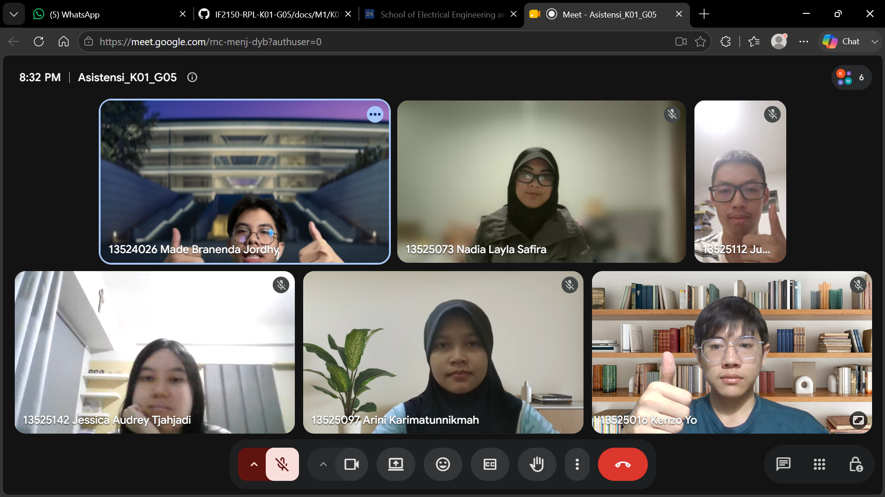

# Form Asistensi

## Tugas Besar IF2150 - Rekayasa Perangkat Lunak

| Informasi | Keterangan |
| --- | --- |
| **Hari** | *\[Minggu\]* |
| **Tanggal** | *\[30/08/2026\]* |
| **Kelas** | *\[Kelas K01\]* |
| **Nomor Kelompok** | *\[5\]*  |
| **Nama Kelompok** | *\[Furina: Forum RPL Indonesia Jaya\]*  |
| **Nama Perangkat Lunak** | *\[APATIS: Aplikasi Pelaporan Air dan Sanitasi\]*  |
| **Dokumen** | *\[K01_G05_TB\]*  |

### Anggota Kelompok

| NIM | Nama |
| --- | --- |
| *13525016* | *Kenzo Yo* |
| *13525112* | *Justin Sepvian* |
| *13525142* | *Jessica Audrey Tjahjadi* |
| *13525073* | *Nadia Layla Safira* |
| *13525097* | *Arini Karimatunnikmah* |

### Catatan

| Catatan |
| --- |
| 1. *Scope dari perangkat lunak apakah sudah baik?* Jawab: *Kalau spek ga ada ketentuannya, jadi dibebaskan*  |
| 2. *Tips: Sebisa mungkin nanti setiap pengumpulan draft sudah ada isi teks di setiap poin* |
| 3. *Dari tambahan tadi di 3.3, apa bedanya atau kebutuhan pengguna ya?* Jawab: *Yang bagian Pengguna awal itu apa yang aktor butuhkan, kalau bagian yang deskripsi aktivitas itu menyatakan langkah apa yang bakal ada di aplikasi nanti*|
| 4. *Misal aktornya cuma dua, apakah user ID-nya nanti beda? Lalu, setiap kategori gitu boleh banyak ga pelapornya?* Jawab: *Iya. Setiap kategori boleh banyak tapi kebutuhannya berbeda* |
|5. *Bagian Asumsi dan Batasan itu gimana ya kak* Jawab: *Asumsi itu anggapan yang kalau salah masih gapapa, batasan itu seperti hukum gitu dan harus mencakup ketiga aspek yang disebutkan: regulasi, keterbatasan, dan ruang lingkup* |
|6. *Apakah 1.2 Analisis Kondisi Saat Ini harus mendetail?* Jawab: *Harusnya bebas, tapi disarankan lebih mendetail*|
|7. *Apakah bagian 2.1 sudah oke?* Jawab *Sudah*|
|8. *Apakah boleh pakai poin-poin gitu?* Jawab *Disesuaikan saja, nanti dicek*|
|9. *Boleh Asistensi lebih ga?* Jawab *Boleh*|

**Notes for this section:**  
*Catatan dapat dituliskan dalam bentuk paragraf atau poin-poin, disesuaikan saja.* 

## Dokumentasi

<!--  -->

  

  <i>Gambar 1. Dokumentasi kegiatan asistensi.</i>

