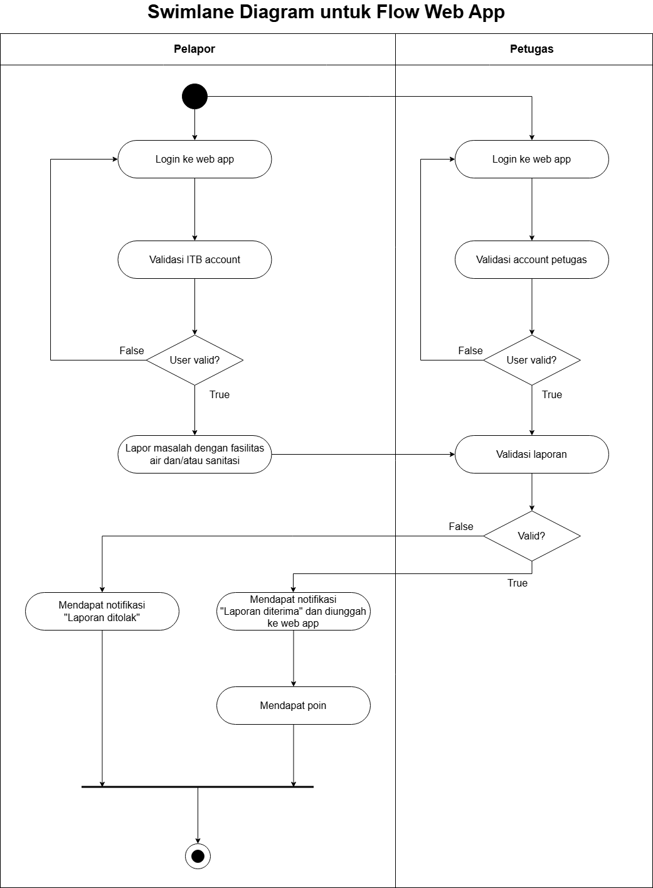

<h1>
IF2150 REKAYASA PERANGKAT LUNAK
 
TUGAS 1
 
TOPIC BRAINSTORMING
</h1>
 

## *APATIS: Aplikasi Pelaporan Air dan Sanitasi*

### Untuk: *Made Branenda Jordhy*

Dipersiapkan oleh:
| Informasi | Keterangan |
| --- | --- |
| Kelas | *\[Kelas K01\]* |
| Kelompok | *\[5\]*  |

| NIM | Nama |
|---|---|
| *13525016* | *Kenzo Yo* |
| *13525112* | *Justin Sepvian* |
| *13525142* | *Jessica Audrey Tjahjadi* |
| *13525073* | *Nadia Layla Safira* |
| *13525097* | *Arini Karimatunnikmah* |
---

 
 

# BAB 1: Analisis Permasalahan

## 1.1 Latar Belakang Masalah
Air bersih dan fasilitas sanitasi merupakan kebutuhan penting dalam mendukung keberjalanan aktivitas sivitas akademika di universitas. Seiring dengan tingginya mobilitas sivitas akademika, kerusakan infrastruktur seperti keran bocor, saluran air mampet, atau toilet yang tidak berfungsi sering terjadi. Permasalahan ini berhubungan langsung dengan Sustainable Development Goals (SDGs) yang ke-6, yaitu Air Bersih dan Sanitasi Layak. Jika tidak segera ditangani, kerusakan ini tidak hanya mengganggu kenyamanan belajar mengajar, tetapi juga menyebabkan pemborosan air dalam skala masif dan memicu masalah kesehatan lingkungan. Oleh karena itu, dibutuhkan proses pelaporan yang mudah dan dapat menyampaikan informasi kerusakan kepada pihak pengelola fasilitas secara jelas.

## 1.2 Analisis Kondisi Saat Ini
Setiap universitas pasti memiliki unit yang bertanggung jawab terhadap pengelolaan dan perbaikan sarana prasarana, termasuk fasilitas air bersih dan layanan perbaikan. Setiap unit juga telah memiliki prosedur untuk melakukan pemeriksaan kondisi fasilitas dan meneruskan kerusakan yang ditemukan kepada pihak terkait.

Namun, dari sisi sivitas akademika, proses untuk melaporkan kerusakan masih dapat menjadi kendala. Ketika menemukan masalah seperti keran bocor, wastafel rusak, atau saluran air tersumbat, pengguna belum tentu mengetahui pihak yang harus dihubungi. Laporan dapat disampaikan secara langsung kepada petugas gedung atau melalui media komunikasi yang tersedia. Akibatnya, laporan berpotensi tersebar dan sulit dipantau dalam satu tempat secara terstruktur. Metode pelaporan seperti ini juga membuat informasi yang diterima belum tentu lengkap. Pelapor mungkin hanya menyebutkan nama gedung tanpa mencantumkan lantai, ruangan, atau foto kerusakan. Pihak pengelola kemudian perlu meminta informasi tambahan atau memeriksa lokasi secara langsung sebelum meneruskan laporan kepada teknisi.

Masalah lain yang dapat muncul adalah adanya beberapa laporan untuk kerusakan yang sama. Sebagai contoh, beberapa mahasiswa dapat menemukan toilet yang rusak lalu melaporkannya secara terpisah. Tanpa tempat yang menampilkan laporan sebelumnya, pengguna tidak dapat mengetahui bahwa kerusakan tersebut sudah pernah dilaporkan. Di sisi lain, pelapor juga belum tentu mengetahui apakah laporannya sudah diterima, sedang ditangani, atau telah selesai diperbaiki.

Dari kondisi tersebut, masih terdapat kebutuhan akan sistem yang sederhana bagi sivitas akademika, tetapi tetap dapat membantu pengelola fasilitas dan teknisi dalam menangani laporan. Sistem yang kami usulkan akan menyediakan satu tempat untuk membuat dan melihat laporan kerusakan fasilitas air dan sanitasi di ITB.

Pengguna dapat mencantumkan foto, deskripsi, serta lokasi kerusakan secara bertingkat, mulai dari fakultas atau area, gedung, lantai, hingga ruangan. Jika kerusakan yang sama sudah dilaporkan, pengguna dapat memberikan upvote tanpa membuat laporan baru. Jumlah upvote juga dapat digunakan sebagai salah satu pertimbangan oleh manajer fasilitas dalam menentukan prioritas penanganan.

Setiap laporan akan melalui status Submitted, Assigned, In Progress, dan Resolved. Dengan adanya status tersebut, pelapor dapat mengetahui perkembangan laporannya, manajer fasilitas dapat memberikan tugas kepada teknisi, dan teknisi dapat mengunggah bukti setelah perbaikan selesai.

Dengan demikian, sistem yang diusulkan tidak menggantikan proses perbaikan fasilitas yang sudah ada di ITB. Sistem ini berfungsi untuk melengkapi proses tersebut dengan menyediakan jalur pelaporan yang terpusat, informasi lokasi yang lebih jelas, pencegahan laporan berulang, dan pemantauan status perbaikan.

---

# BAB 2: Analisis Solusi

## 2.1 Deskripsi Perangkat Lunak
Perangkat lunak ini merupakan solusi dalam meningkatkan efisiensi dan sanitasi suatu tempat. Melalui fitur-fiturnya, pengguna dapat melaporkan secara langsung tempat kebocoran terjadi, beserta dengan lokasi, waktu, dan foto kejadian tersebut. Tidak hanya itu, untuk membantu sanitasi, pengguna dapat melaporkan juga mengenai ketersediaan sabun di suatu tempat, serta memberi laporan jika terdapat kamar mandi yang perlu dibersihkan.

Pastinya, kegiatan melapor tersebut mensyaratkan adanya media yang dapat digunakan kapan saja, seperti ponsel pintar, laptop, ataupun komputer. Kami memilih menggunakan *web application* karena dapat dibuat responsif dengan berbagai jenis perangkat sehingga bersifat fleksibel, sedangkan *mobile application* hanya dapat digunakan oleh ponsel pintar dan pengguna pun harus mengunduhnya terlebih dahulu, begitu pun dengan *desktop application* yang hanya dapat digunakan di komputer.Target pengguna dari perangkat lunak ini dapat berupa siswa, mahasiswa, dosen, dan kalangan umum jika suatu tempat bersedia memakainya.

Perangkat lunak ini memiliki nilai unik yakni mempermudah pelaporan masalah air dan sanitasi pada suatu tempat dengan cepat, fleksibel, dan terpusat. Hal ini pun menjadi pembeda dengan solusi yang sekarang ada, yakni dengan mengontak petugas kebersihan melalui kanal media, seperti WhatsApp, atau bahkan pengguna kadang harus mencari terlebih dahulu keberadaan petugas tersebut. Karenanya, perangkat lunak ini pun menawarkan kecepatan dan fleksibilitas laporan karena dapat dilakukan di mana saja dan kapan pun saja. Selain itu, seluruh data juga dikirimkan ke suatu pusat yang dapat dilihat oleh petugas kebersihan untuk menanggapi laporan-laporan tersebut sehingga manajemen laporan menjadi lebih terpusat. 

## 2.2 Asumsi dan Batasan
Asumsi yang menjadi dasar pengembangan sebagai berikut.
1. Setiap pengguna memiliki gawai yang dilengkapi kamera.
2. Setiap pengguna memiliki akun gmail ITB.
3. Setiap pengguna memiliki koneksi internet yang stabil sehingga mempu mengirimmkan laporan melalui aplikasi.
4. Setiap pengguna memiliki kesadaran dan kepedulian terhadap SDGs 6 Air Bersih dan Sanitasi.
5. Setiap pengguna yang berperan sebagai petugas memahami denah kampus ITB.

Batasan dari solusi yang akan dikembangkan sebagai berikut.
1. Ruang lingkup solusi adalah pada kampus ITB baik Kampus Ganesha, Kampus Jatinangor, Kampus Cirebon, dan Kampus Jakarta.
2. Ruang lingkup SDG 6 (Sustainable Development Goal 6: Air Bersih dan Sanitasi Layak) berfokus pada menjamin ketersediaan serta pengelolaan air bersih dan sanitasi yang berkelanjutan untuk semua orang.
3. Sumber daya dalam pengembangan web application ini terbatas pada 5 mahasiswa informatika dengan penggunaan AI tertera pada bagian AI Usage.
4. Berdasarkan UU ITE No. 11 Tahun 2008 (Pasal 26), penggunaan data pribadi yang digunakan perangkat lunak harus dijabarkan secara jelas dengan meminta persetujuan penguna pada awal registrasi aplikasi. Peangksesan foto untuk keperluan pelaporan juga berdasarkan persetujuann pengguna.

---

# BAB 3: Spesifikasi Kebutuhan dan Proses Bisnis

## 3.1 Identifikasi Aktor
Berikut penjelasan singkat mengenai peran dan karakteristik dari masing-masing aktor yang akan berinteraksi langsung dengan sistem ini.

| Aktor | Deskripsi |
| :--- | :--- |
| *Pelapor* | *Pengguna ini bertindak sebagai pihak yang secara sukarela melaporkan kejadian seperti kebocoran, ketersediaan sabun di suatu tempat, kamar mandi yang perlu dibersihkan, serta kualitas air. Karakteristik dari pengguna ini adalah mengutamakan kemudahan dalam proses pelaporan dan sistem leaderboard yang transparan.* |
| *Petugas* | *Pengguna ini bertanggung jawab untuk memantau laporan yang dikirimakan oleh keluarga besar ITB serta meresponnya. Karakteristik dari pengguna ini adalah mengutamakan keakuratan dan sistem pelaporan terpusat yang ringkas* |

## 3.2 Kebutuhan Pengguna Awal
| ID | Aktor | Kebutuhan / Aktivitas | Tujuan / Nilai |
| :--- | :--- | :--- | :--- |
| US-01 | *Pelapor* |  *Melapor masalah fasilitas air dan/atau sanitasi* | *Masalah fasilitas dapat diketahui oleh petugas fasilitas dengan cepat* |
| US-02 | *Pelapor* | *Melampirkan foto dan deskripsi permasalahan yang dilapor* | *Petugas fasilitas dapat menanganinya dengan tepat* |
| US-03 | *Pelapor* | *Melihat laporan yang dibuat oleh orang lain* | *Menegetahui masalah yang sudah dilapor* |
| US-04 | *Pelapor* | *Melakukan upvote pada laporan yang ada* | *Petugas dapat mengetahui masalah yang perlu diprioritas* |
| US-05 | *Pelapor* | *Melihat status laporan yang disampaikan* | *Mendapatkan transparansi terkait progres laporan yang dibuat* |
| US-06 | *Petugas fasilitas* | *Menerima laporan masalah* | *Petugas dapat mengetahui masalah yang ada dengan detail dari pelapor* |
| US-07 | *Pelapor* | *Mendapatkan poin berdasarkan laporan yang dibuat* | *Menambah poin pada leaderboard untuk hadiah* |
| US-08 | *Pelapor* | *Membuat akun pada perangkat lunak* | *Sebagai identitas pengguna di web* |

## 3.3 Deskripsi Aktivitas
Buatlah daftar seluruh aktivitas yang terdapat dalam sistem solusi, lengkap dengan ID dan penjelasan jika perlu. Bisa dibuat dalam bentuk tabel.
| ID | Aktivitas | Penjelasan |
| :--- | :--- | :--- |
| AK01 | Melakukan login pada web app | Pengguna akan login dengan account ITB untuk mulai menggunakan web appnya. |
| AK02 | Melaporkan masalah fasilitasi air dan/atau sanitasi | Pengguna melaporkan keluhan tentang fasilitas air yang ia gunakan. |
| AK03 | Memvalidasi laporan | Petugas akan melakukan filter agar konten di web app sesuai. |
| AK04 | Membaca laporan-laporan yang telah divalidasi | Pengguna mendapatkan informasi tentang fasilitas yang sedang rusak. |
| AK05 | Like sebuah laporan | Pengguna dapat membawa atensi pada sebuah masalah yang telah dilaporkan pengguna lain agar fasilitas tersebut dapat diperbaiki lebih cepat oleh petugas. |

## 3.4 Model Proses Bisnis
Buatlah Activity Diagram atau Swimlane Diagram yang menunjukkan alur kerja proses bisnis dari sistem solusi. Diagram ini harus memvisualisasikan bagaimana alur operasional di dunia nyata berjalan lebih efisien dengan adanya interaksi antara aktor (yang didefinisikan pada poin 3.1) dan sistem perangkat lunak. Perhatikan notasi yang digunakan dalam pembuatannya.
 

<i>Gambar 1. Swimlane Diagram untuk Alur Kerja Web App</i>

