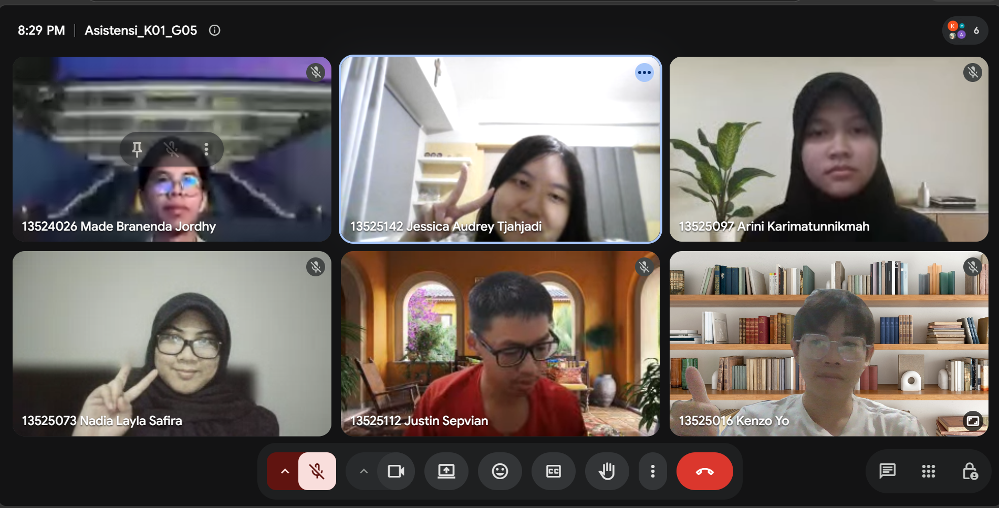

# Form Asistensi

## Tugas Besar IF2150 - Rekayasa Perangkat Lunak

| Informasi | Keterangan |
| --- | --- |
| **Hari** | *\[Senin\]* |
| **Tanggal** | *\[07/09/2026\]* |
| **Kelas** | *\[Kelas K01\]* |
| **Nomor Kelompok** | *\[5\]*  |
| **Nama Kelompok** | *\[Furina: Forum RPL Indonesia Jaya\]*  |
| **Nama Perangkat Lunak** | *\[APATIS: Aplikasi Pelaporan Air dan Sanitasi\]*  |
| **Dokumen** | *\[K01_G05_RG\]*  |

### Anggota Kelompok

| NIM | Nama |
| --- | --- |
| *13525016* | *Kenzo Yo* |
| *13525112* | *Justin Sepvian* |
| *13525142* | *Jessica Audrey Tjahjadi* |
| *13525073* | *Nadia Layla Safira* |
| *13525097* | *Arini Karimatunnikmah* |

### Catatan

| Catatan |
| --- |
| 1. *Asisten membantu menjelaskan setiap subbab untuk meningkatkan pemahaman, dimulai dari Bab 1, yakni Deskripsi Umum harus menjelaskan dengan cukup detail mengenai ekspektasi pengguna, alur kerja, dan harapan pengguna terhadap sistem solusi. Untuk bagian Deskripsi Pengguna Perangkat Lunak dipertegas aja*  |
| 2. *Bab 2, subbab 2.3, Buat mengisi tabel di 2.3, harus mengambil aktivitas dari tabel 2.2 terlebih dahulu, terus baru menentukan 3 hal yakni user, business, dan system requirement, serta satu aktivitas itu dapat menghasilkan lebih dari satu kebutuhan* |
| 3. *Kebutuhan fungsional itu apa yang di-state dari tabel 2.3, satu kebutuhan fungsional bisa lebih dari satu id kebutuhan* |
| 4. *Kebutuhan nonfungsional, ambil beberapa parameter yang sesuai saja* |
| 5. *Apakah untuk draft ini deskripsi umum sistem udah aman? Jawab: Sudah oke, paling dibuat lebih terpisah aja pengguna dan petugasnya* |
| 6. *Tambahan dari asisten: Buat KNF dan KF harus pakai framework EARS, jadi contoh di template belum begitu benar, ikutin dari ppt aja* |
| 7. *Boleh menambahkan admin sebagai aktor ga? Jawab: Boleh, nanti tinggal ditambah di tabel perubahan aja* |
| 8. *Buat bagian 1.2, pelapor aktif dan pasif bisa digabung aja karena mereka perannya kurang lebih sama dan satu aktor bisa berperan banyak gitu* |

**Notes for this section:**  
*Catatan dapat dituliskan dalam bentuk paragraf atau poin-poin, disesuaikan saja.* 

## Dokumentasi

<!--  -->

  

  <i>Gambar 1. Dokumentasi kegiatan asistensi.</i>

