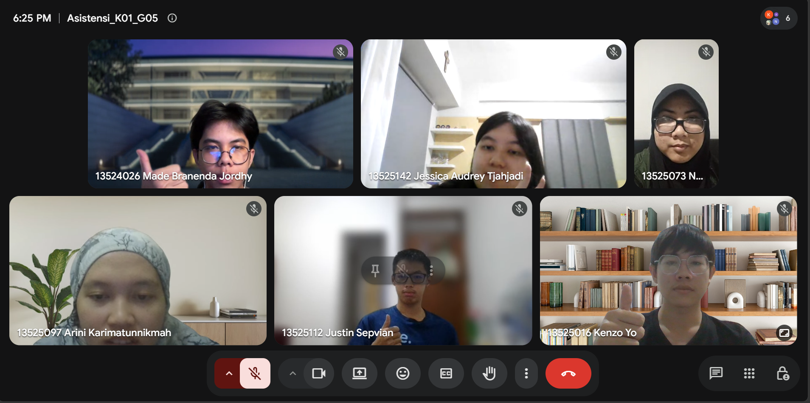

# Form Asistensi

## Tugas Besar IF2150 - Rekayasa Perangkat Lunak

| Informasi | Keterangan |
| --- | --- |
| **Hari** | *\[Selasa\]* |
| **Tanggal** | *\[15/09/2026\]* |
| **Kelas** | *\[K01\]* |
| **Nomor Kelompok** | *\[5\]*  |
| **Nama Kelompok** | *\[Furina: Forum RPL Indonesia Jaya\]*  |
| **Nama Perangkat Lunak** | *\[APATIS: Aplikasi Pelaporan Air dan Sanitasi\]*  |
| **Dokumen** | *\[K01_G05_UC\]*  |

### Anggota Kelompok

| NIM | Nama |
| --- | --- |
| *13525016* | *Kenzo Yo* |
| *13525112* | *Justin Sepvian* |
| *13525142* | *Jessica Audrey Tjahjadi* |
| *13525073* | *Nadia Layla Safira* |
| *13525097* | *Arini Karimatunnikmah* |

### Catatan

| Catatan |
| --- |
| 1. *Skenario sebaiknya dibuat atomik kalau langkah per langkahnya begitu*  |
| 2. *Semisal menggunakan prekondisi, taruh di mana? Jawab: Prekondisi taruh tepat di bawah nama usecase skenario* |
| 3. *Kalau scope-nya terlalu kecil di use case, bisa dijadikan prekondisi (misal, login)* |
| 4. *Include itu hal-hal yang diperlukan oleh suatu use case, sedangkan extend itu yang opsional (misal, menerapkan voucher di mesin)* |
| 5. *Pastikan scope use case tidak terlalu luas ataupun tidak terlalu sempit, dan di bagian skenario dibuat selang-seling aktor dengan reaksi sistem* |
| 6. *Coba cari edge cases dari use case yang ada, untuk memudahkan nantinya pas implementasi* |

**Notes for this section:**  
*Catatan dapat dituliskan dalam bentuk paragraf atau poin-poin, disesuaikan saja.* 

## Dokumentasi

<!--  -->

  

  <i>Gambar 1. Dokumentasi kegiatan asistensi.</i>

