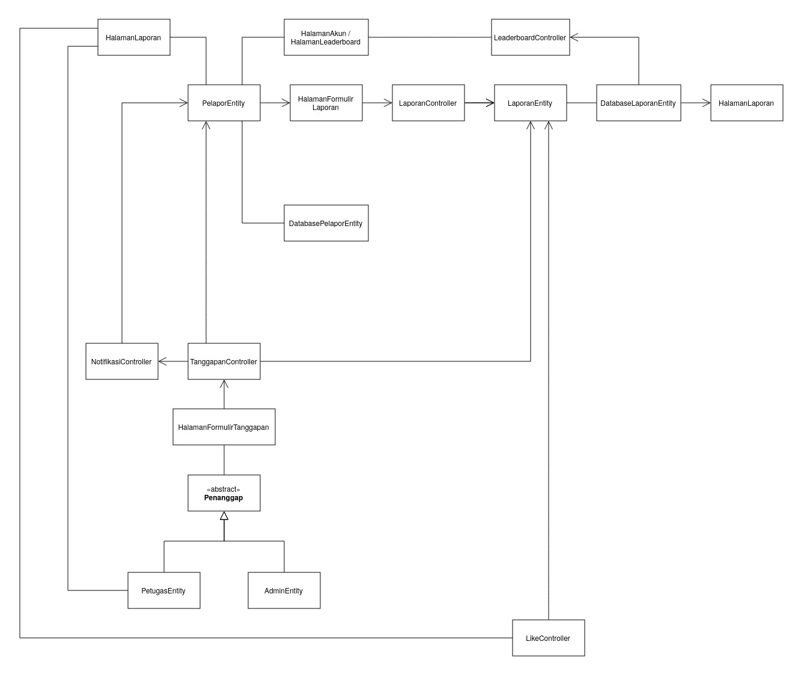

<h1>
IF2150 REKAYASA PERANGKAT LUNAK
 
TUGAS 4
 
CLASS DIAGRAM
</h1>
 

## *APATIS: Aplikasi Pelaporan Air dan Sanitasi*

### Untuk: *Made Branenda Jordhy*

Dipersiapkan oleh:
| Informasi | Keterangan |
| --- | --- |
| Kelas | *\[Kelas K01\]* |
| Kelompok | *\[5\]*  |

| NIM | Nama |
|---|---|
| *13525016* | *Kenzo Yo* |
| *13525112* | *Justin Sepvian* |
| *13525142* | *Jessica Audrey Tjahjadi* |
| *13525073* | *Nadia Layla Safira* |
| *13525097* | *Arini Karimatunnikmah* |
---

## Daftar Perubahan

| Revisi | Deskripsi |
| :--- | :--- |
| *A* | *Mengubah prasyarat Skenario UC03 agar lebih tepat, yakni dari admin melakukan login menjadi pelapor melakukan login* |

 
 

# BAB 1: Deskripsi Perangkat Lunak

Sistem perangkat lunak ini merupakan gabungan dari perangkat lunak dan pengguna. Pada sistem solusi ini, pengguna akan menggunakan perangkat lunak untuk melaporkan berbagai permalasahan fasilitas air dan sanitasi di ITB, seperti kebocoran air, kualitas air, perlengkapan kamar mandi yang kurang, dan sebagainya. Melalui sistem ini, pengguna berekspektasi memiliki pengalaman yang lebih mudah dan transparan dalam melaporkan suatu permasalahan air dan sanitasi di ITB. 

Sistem solusi ini memiliki alur kerja yang sederhana, yakni pengguna, yang merupakan civitas academica, sebagai pelapor terhadap suatu masalah mengenai fasilitas air dan sanitasi di ITB, petugas sebagai pengguna yang menanggapi laporan tersebut, dan admin sebagai pengguna yang melakukan tugas administratif, seperti validasi teknis laporan dan pemberian poin terhadap laporan yang valid dan sah.

Penerapan dari sistem solusi ini diharapkan dapat mempermudah pelaporan terkait masalah fasilitas sanitasi dan air di ITB, serta memusatkan sistem pelaporan dan mempercepat penanggapan laporan tersebut. Dengan adanya sistem ini, Sustainable Development Goals (SDG) yang ke-6, yakni mengenai air bersih dan sanitasi, diharapkan dapat lebih tercapai dan terpenuhi di ITB.

---

# BAB 2: Kebutuhan Fungsional

## 2.1 Kebutuhan Fungsional

Tabel 2.1. Daftar Kebutuhan Fungsional

| ID KF | ID Kebutuhan | Penjelasan |
| :--- | :--- | :--- |
| *KF01* | *R02* | *Sistem harus memasukan pengguna ke dalam akun yang benar dan mengakses fitur yang sesuai peran yang telah terdaftar.* |
| *KF02* | *R03* | *Sistem harus dapat mengidentifikasi setiap akun sesuai perannya, yaitu Pelapor, Petugas, atau Admin.* |
| *KF03* | *R05* | *Ketika pengguna ingin melapor, sistem harus memperbolehkan pengguna untuk membuat laporan dan mencantum kategori, deskripsi, foto, waktu, dan lokasi masalah mengenai fasilitas air dan/atau sanitasi.* |
| *KF04* | *R10* | *Sistem harus mengizinkan Admin dan Petugas untuk melihat, memvalidasi, lalu menerima atau menolak laporan.* |
| *KF05* | *R11* | *Ketika sebuah laporan dinyatakan valid oleh Petugas, sistem harus memperbolehkan pengguna untuk melihat laporan tersebut di halaman utama atau feed dengan isinya, seperti detail foto, deskripsi, lokasi, waktu, status, dan jumlah _like_.* |
| *KF06* | *R12* | *Selama sebuah laporan dinyatakan valid, sistem harus memperbolehkan pengguna untuk memberikan dan membatalkan _like_ pada laporan tersebut.* |
| *KF07* | *R13* | *Bila seorang pengguna memberikan lebih dari satu _like_ di sebuah laporan, maka sistem harus membatasi agar hanya dapat memberi satu like pada laporan yang sama.* |
| *KF08* | *R14* | *Sistem harus memperbarui jumlah like setelah tindakan pengguna berhasil diproses, yaitu memberi atau membatalkan _like_.* |
| *KF09* | *R15* | *Sistem harus memperbolehkan Petugas untuk mengubah status laporan sesuai dengan perkembangan penanganannya.* |
| *KF10* | *R16* | *Ketika laporan dinyatakan valid oleh Petugas atau Admin, sistem harus dapat memberi pemilik laporan sebuah poin.* |
| *KF11* | *R17* | *Ketika laporan dinyatakan valid oleh Petugas atau Admin, sistem harus menunjukkan poin pengguna menambah.* |
| *KF12* | *R18* | *Sistem harus membatasi informasi yang ditampilkan di leaderboard, seperti peringkat dan total poin pengguna sendiri serta nama, peringkat, dan total poin semua pengguna dalam top 20.* |
| *KF13* | *R20* | *Sistem harus dapat menunjukkan calon penerima merchandise pada akhir bulan, yaitu pelapor yang top 20.* |
| *KF14* | *R21* | *Ketika sudah akhir bulan, sistem harus menghitung dan menampilkan hasil top 20 di leaderboard.* |

---

# BAB 3: Model Use Case

## 3.1 Identifikasi Aktor

| Aktor | Deskripsi |
| :--- | :--- |
| *Pelapor* | *Pengguna eksternal yang melaporkan kerusakan fasilitas air dan sanitasi sehingga memperoleh poin serta melihat dan memberikan like atau unlike pada laporan kerusakan fasilitas air dan sanitasi dalam sistem APATIS yang telah dilaporkan pengguna lain.* |
| *Petugas* | *Pengguna yang menanggapi laporan yang masuk, menentukan dan memberikan status apakah laporan tersebut merupakan kersusakan pada fasilitas air dan sanitasi atau bukan, serta memberikan status pada laporan telah dituntaskan.* |
| *Admin* | *Pengguna yang mengelola validitas laporan secara administratif serta memberikan catatan pada kekurangan laporan.* |

## 3.2 Identifikasi Use Case

| ID UC | Nama Use Case | Deskripsi Singkat | Aktor Terlibat | ID KF Terkait |
| :--- | :--- | :--- | :--- | :--- |
| *UC01* | *Melakukan pelaporan* | *Pengguna melakukan pelaporan terkait masalah air dan/atau sanitasi yang ditemukan. Pengguna mengisi formulir laporan dengan menggunggah bukti pendukung beserta deskripsi masalah. Laporan akan diterima oleh petugas dan admin untuk diproses validitasnya terlebih dahulu. Laporan yang valid akan diproses penanganannya dan laporan yang tidak valid akan ditolak dengan tanggapan.* | *Pelapor* | *KF01, KF02, KF03, KF04* |
| *UC02* | *Memberikan status laporan* | *Petugas dan admin mampu memberikan status laporan berupa penerimaan, penolakan, dan progres yang dapat disertai dengan tanggapan. Status laporan dapat disunting kapan saja oleh petugas dan admin. Status laporan dapat dilihat kapan saja oleh pengguna, baik yang dibuat sendiri dan yang dibuat oleh pengguna lain.* | *Petugas, Admin* | *KF04, KF09, KF05* |
| *UC03* | *Memberi dan membatalkan like* | *Pengguna dapat memberikan like pada laporan yang dirasa perlu diprioritaskan, baik laporan yang dibuat sendiri dan yang dibuat oleh pengguna lain. Apabila pengguna memiliki pendapat yang berbeda setelah memberikan like, pengguna dapat membatalkan like tersebut. Petugas dapat mengetahui daftar prioritas dari masalah yang dilaporkan.* | *Pelapor, Petugas* | *KF05, KF06, KF07, KF08* |
| *UC04* | *Memperoleh poin* | *Pengguna akan memperoleh poin untuk setiap laporan yang telah dinyatakan valid oleh petugas dan admin. Poin yang diperoleh dapat dilihat pada akunnya sendiri atau pada leaderboard.Melalui leaderboard, pengguna dapat mengetahui peringkatnya sendiri dan pengguna yang menempati peringkat 20 ke atas. Pengguna yang menempati peringkat 20 ke atas pada akhir bulan akan mendapatkan merchandise sesuai dengan peringkatnya.* | *Pelapor* | *KF10, KF11, KF12, KF13, KF14* |

## 3.3 Use Case Diagram

 

<i>Gambar 1. Use Case Diagram APATIS</i>

 

## 3.4 Skenario Use Case

### 3.4.1 Skenario UC01

**Nama Use Case:** *Melaporkan Masalah Fasilitas Air atau Sanitasi di ITB*

**Aktor:** *Pelapor*

**Prasyarat:** *Pelapor telah melakukan login*

**Skenario Normal**

| No | Aksi Aktor | Reaksi Perangkat Lunak |
| :--- | :--- | :--- |
| 1 | *Pelapor menekan tombol lapor* ||
| 2 || *Sistem menampilkan halaman laporan yang berisi formulir laporan* |
| 3 | *Pelapor mengisi formulir laporan dengan lengkap* ||
| 4 || *Sistem menerima data dari kolom-kolom yang diisi pelapor pada _front-end_ atau antarmuka dan secara bersamaan melakukan validasi teknis (misal, jumlah karakter deskripsi laporan, jenis file foto)* |
| 5 | *Pelapor mengonfirmasi pengiriman laporan* ||
| 6 || *Sistem menerima data formulir laporan dan mengirimnya ke database sebagai daftar laporan untuk ditanggapi Petugas atau Admin* |

 

**Skenario Alternatif 1: Laporan Tidak Valid Secara Teknis**

**Prasyarat:** *Pelapor telah melakukan login*

| No | Aksi Aktor | Reaksi Perangkat Lunak |
| :--- | :--- | :--- |
| 1 | *Pelapor menekan tombol lapor untuk membuat laporan* ||
| 2 || *Sistem menampilkan halaman formulir laporan* |
| 3 | *Pelapor mengisi formulir laporan, tetapi salah satu aspek teknis laporan (misal, jumlah karakter tidak melebihi batas, jenis file foto sesuai, dan kolom yang wajib diisi terisi semua) tidak terpenuhi* |
| 4 || *Sistem menampilkan pesan _error_ yang sesuai dengan aspek teknis yang tidak terpenuhi* |
| 5 | *Pelapor menyesuaikan laporannya* ||
| 6 || *Sistem kembali ke langkah 2 skenario normal* |

### 3.4.2 Skenario UC02

**Nama Use Case:** *Memberikan Status Laporan*

**Aktor:** *Petugas, Admin*

**Prasyarat:** *Petugas telah melakukan login*

**Skenario Normal**

| No | Aksi Aktor | Reaksi Perangkat Lunak |
| :--- | :--- | :--- |
| 1 | *Petugas membuka daftar laporan* ||
| 2 || *Sistem menampilkan seluruh laporan beserta status laporan tersebut* |
| 3 | *Petugas mengubah status salah satu laporan (misal, penerimaan, penolakan, dan _progress_ berupa tanggapan)* ||
| 4 || *Sistem memperbarui data status laporan pada _front-end_ atau antarmuka untuk dikirim nantinya* |
| 5 | *Petugas menekan tombol untuk mengirim perubahan status laporan* ||
| 6 || *Sistem mengirimkan data perubahan status laporan ke basis data* |
| 7 || *Sistem mengirimkan notifikasi perubahan laporan ke pelapor yang berkaitan* | 
| 8 || *Sistem memberi poin jika laporannya diterima, sebaliknya laporan dihapus jika ditolak* |
 

**Skenario Alternatif 1: Admin Melakukan Validasi Administratif / Moderasi**

**Prasyarat:** *Admin telah melakukan login*

| No | Aksi Aktor | Reaksi Perangkat Lunak |
| :--- | :--- | :--- |
| 1 | *Admin membuka daftar laporan* ||
| 2 || *Sistem menampilkan daftar laporan beserta status dari laporan tersebut* |
| 3 | *Admin mengubah salah satu status laporan karena alasan administratif, seperti laporan yang tidak senonoh, spam, laporan palsu, dan sebagainya* ||
| 4 || *Sistem memperbarui data status laporan pada _front-end_ atau antarmuka untuk dikirim nantinya* |
| 5 | *Admin menekan tombol untuk mengirim perubahan status laporan* ||
| 6 || *Sistem mengirimkan data perubahan status laporan ke basis data* |
| 7 || *Sistem mengirimkan notifikasi perubahan laporan ke pelapor yang berkaitan* | 
| 8 || *Sistem memberi poin jika laporannya diterima, sebaliknya laporan dihapus jika ditolak* |

## 3.4.3 Skenario UC03

**Nama Use Case:** *Memberikan dan Membatalkan _Like_*  

**Aktor:** *Pelapor, Petugas*

**Prasyarat:** *Pelapor telah melakukan login*

**Skenario Normal: Memberikan Like**

| No | Aksi Aktor | Reaksi Perangkat Lunak |
| :- | :--------- | :--------------------- |
| 1  | *Pelapor melihat daftar laporan pada halaman utama APATIS.* ||
| 2  || *Sistem menampilkan laporan yang telah dinyatakan valid beserta jumlah like pada setiap laporan.*|
| 3  | *Pelapor menekan tombol like pada salah satu laporan.* ||
| 4  || *Sistem memeriksa bahwa Pelapor belum pernah memberikan like pada laporan tersebut.* |
| 5  | *Pelapor menunggu proses pemberian like.* ||
| 6  || *Sistem menyimpan like, menambah jumlah like sebanyak satu, dan menampilkan tombol like di laporan dalam keadaan aktif.*  |

**Skenario Alternatif 1: Membatalkan Like**

**Prasyarat:** *Pelapor telah melakukan login*

| No | Aksi Aktor | Reaksi Perangkat Lunak |
| :- | :--------- | :--------------------- |
| 1  | *Pelapor melihat daftar laporan yang sebelumnya telah diberi like.* ||
| 2  || *Sistem menampilkan tombol like dalam keadaan aktif.*|
| 3  | *Pelapor menekan kembali tombol like pada laporan tersebut.* ||
| 4  || *Sistem menghapus like yang sebelumnya diberikan oleh Pelapor.* |
| 5  | *Pelapor menunggu proses pembatalan like.* ||
| 6  || *Sistem mengurangi jumlah like sebanyak satu dan menampilkan tombol like dalam keadaan tidak aktif.*  |

## 3.4.4 Skenario UC04

**Nama Use Case:** *Memperoleh Poin*  

**Aktor:** *Pelapor* 

**Prakondisi:** *Pelapor telah login dan telah mengirimkan laporan.*

**Skenario Normal**

| No | Aksi Aktor | Reaksi Perangkat Lunak |
| :- | :--------- | :--------------------- |
| 1  | *Pelapor menunggu laporan diproses.* ||
| 2  || *Sistem menampilkan laporan kepada Admin atau Petugas untuk divalidasi.*|
| 3  | *Pelapor menunggu hasil validasi laporan.* ||
| 4  || *Sistem mencatat bahwa laporan telah divalidasi dan diterima oleh Admin atau Petugas.* |
| 5  | *Pelapor menerima pemberitahuan bahwa laporannya telah diterima.* ||
| 6  || *Sistem memberikan poin kepada Pelapor dan memperbarui jumlah poin pada akun Pelapor.*  |

**Skenario Alternatif 1: Laporan Tidak Lolos Validasi oleh Admin atau Petugas**

**Prakondisi:** *Pelapor telah login dan telah mengirimkan laporan.*

| No | Aksi Aktor | Reaksi Perangkat Lunak |
| :- | :--------- | :--------------------- |
| 1  | *Pelapor menunggu laporan diproses.* ||
| 2  || *Sistem menampilkan laporan kepada Admin atau Petugas untuk divalidasi.*|
| 3  | *Pelapor menunggu hasil validasi laporan.* ||
| 4  || *Sistem mencatat bahwa laporan tidak lolos validasi oleh Admin atau Petugas.* |
| 5  | *Pelapor menerima pemberitahuan bahwa laporannya tidak diterima.* ||
*Lanjutkan pola 3.4.x ini untuk setiap ID UC pada 3.2, sampai seluruh use case tercakup.*

---

# BAB 4: Diagram Kelas

## 4.1 Identifikasi Kelas

| ID Kelas | Nama Kelas | Deskripsi Kelas | ID Use Case |
| :--- | :--- | :--- | :--- |
| *C01* | *PelaporEntity* | *Menyimpan data akun pelapor yang membuat nama dan NIM/NIP bagi civitas akademika ITB.* | *UC01, UC02, UC03, UC04* |
| *C02* | *LaporanEntity* | *Menyimpan data laporan berupa deskripsi masalah, lokasi, bukti foto, tombol like dan banyak like-nya, beserta status validitasnya secara administrasi dan status penanganannya.* | *UC01, UC02, UC03* |
| *C03* | *HalamanLaporan* | *Menampilkan seluruh laporan terurut dari laporan dengan like terbanyak dari pengguna lain yang telah disetujui admin dan petugas dilengkapi dengan tombol untuk memberikan like serta tombol untuk mulai membuat laporan bagi pelapor. Selain itu, tombol tanggapan bagi admin dan petugas.* | *UC03* |
| *C04* | *HalamanFormulirLaporan* | *Menerima input pelapor berupa deskripsi masalah, lokasi, dan bukti pendukung. Pada bagian ini juga terdapat tombol konfirmasi untuk mengirimkan laporan. Pada masing-masing bentuk input terdapat validasi teknis yang harus dipenuhi seperti maksimal karakter dan maksimal ukuran foto, jika tidak memenuhi validasi teknis ini halaman akan menampilkan pesan kesalahan.* | *UC01* |
| *C05* | *LaporanController* | *Mengarahkan pelapor untuk membuat laporan dari tombol lapor hingga keterangan berhasil atau gagal.* | *UC01* |
| *C06* | *AdminEntity* | *Menyimpan data akun admin yang memuat nama, NIP, dan sebagainya.* | *UC02* |
| *C07* | *PetugasEntity* | *Menyimpan data akun admin yang memuat nama, NIP, dan sebagainya.* | *UC02, UC03* |
| *C08* | *HalamanFormulirTanggapan* | *Hanya ada pada akun admin dan petugas. Menerima input dari admin berupa pilihan untuk terima, tolak, atau ditangguhkan sebuah laporan berdasarkan administratif dan/atau petugas berupa berkaitan atau tidaknya laporan dengan masalah air dan sanitasi ITB serta status belum ditangani, dalam penanganan, atau tuntasnya sebuah laporan, catatan, serta tombol kirim.* | *UC02* |
| *C09* | *TanggapanController* | *Mengarahkan pengguna untuk memberikan tanggapan dimulai dari membuka laporan yang ingin ditanggapi hingga muncul pesan berhasil terkirim. Kelas ini juga mengatur penambahan poin pada laporan yang valid.* | *UC02, UC04* |
| *C10* | *LikeController* | *Mengatur pemberian like dan pembatalan like oleh pengguna.* | *UC03* |
| *C11* | *HalamanLeaderboard* | *Menampilkan perolehan 20 pelapor dengan poin terbanyak, serta menampilkan peringkat dan jumlah poin pemilik akun.* | *UC04* |
| *C12* | *DatabaseLaporanEntity* | *Menyimpan data formulir laporan yang telah dikirim berupa deskripsi  masalah, lokasi, dan bukti foto baik yang sudah divalidasi maupun yang belum.* | *UC01, UC02, UC03* |
| *C13* | *DatabasePelaporEntity* | *Menyimpan data diri pelapor termasuk jumlah poin yang dimiliki.* | *UC04* |
| *C14* | *LeaderboardController* | *Mengarahkan pengguna untuk melihat perolehan poin yang ia miliki.* | *UC04* |
| *C15* | *HalamanAkun* | *Menampilkan data akun pelapor yang membuat nama dan NIM/NIP bagi civitas akademika ITB serta perolehan poin yang dimiliki.* | *UC04* |
| *C16* | *HalamanNotifikasi* | *Menampilkan laporan pengguna yang telah disetujui admin dan/atau petugas.* | *UC02, UC04* |
| *C17* | *NotifikasiController* | *Mengarahkan pengguna pada halaman tempat laporannya disetujui atau tidak.* | *UC02, UC04* |

## 4.2 Diagram Kelas per Use Case

#### Identifikasi Kelas
### 4.2.1 Use Case UC01

**Nama Use Case:** *Melakukan pelaporan*

#### Identifikasi Kelas

| ID Kelas | Nama Kelas | Deskripsi Kelas |
| :--- | :--- | :--- |
| *C01* | *PelaporEntity* | *Menyimpan data akun pelapor yang membuat nama, NIM/NIP bagi civitas akademika ITB, poin yang dimiliki, serta riwayat laporan.* |
| *C02* | *LaporanEntity* | *Menyimpan data laporan berupa deskripsi masalah, lokasi, bukti foto, tombol like dan banyak like-nya, beserta status validitasnya secara administrasi dan status penanganannya.* |
| *C04* | *HalamanFormulirLaporan* | *Menerima input pelapor berupa data diri pelapor, deskripsi masalah, lokasi, dan bukti pendukung. Pada bagian ini juga terdapat tombol konfirmasi untuk mengirimkan laporan. Pada masing-masing bentuk input terdapat validasi teknis yang harus dipenuhi seperti maksimal karakter dan maksimal ukuran foto, jika tidak memenuhi validasi teknis ini halaman akan menampilkan pesan kesalahan.* |
| *C05* | *LaporanController* | *Mengarahkan pelapor untuk membuat laporan dari tombol lapor hingga keterangan berhasil atau gagal.* |
| *C12* | *DatabaseLaporanEntity* | *Menyimpan data diri pelapor termasuk jumlah poin yang dimiliki.* |

#### Diagram Kelas

<i>Gambar 2. Diagram Kelas Use Case UC01</i>

 

| ID Kelas | Nama Kelas | Atribut | Metode/Operasi |
| :--- | :--- | :--- | :--- |
| *C01* | *PelaporEntity* | *idPelapor, namaPelapor, nimnipPelapor, poinPelapor* | *getIdPelapor(), getNamaPelapor(), getNimNipPelapor(), getPoinPelapor(), setIdPelapor(), setNamaPelapor(), setNimNipPelapor(), setPoinPelapor()* |
| *C02* | *LaporanEntity* | *idLaporan, descLaporan, fotoLaporan, likeLaporan, statusLaporan* | *getIdLaporan(), getDescLaporan(), getFotoLaporan(), getLikeLaporan(), getStatusLaporan(), setIdLaporan(), setDescLaporan(), setFotoLaporan(), setLikeLaporan(), setStatusLaporan()* |
| *C04* | *HalamanFormulirLaporan* | *maxKarakter, maxUkuranFoto, laporanValid* | *isJumlahKarakterValid(), isUkuranFotoValid(), isLaporanValid()* |
| *C05* | *LaporanController* | *laporanValid* | *isLaporanValid(), setStatusLaporan(), getValidLaporan()* |
| *C12* | *DatabaseLaporanEntity* | *daftarLaporan* | *getLaporanData(), setLaporanData(), insertNewLaporan()* |

### 4.2.2 Use Case UC02

**Nama Use Case:** *Memberikan status laporan*

#### Identifikasi Kelas

| ID Kelas | Nama Kelas | Deskripsi Kelas |
| :--- | :--- | :--- |
| *C06* | *AdminEntity* | *Menyimpan data akun admin yang memuat nama, NIP, dan sebagainya.* |
| *C07* | *PetugasEntity* | *Menyimpan data akun admin yang memuat nama, NIP, dan sebagainya.* |
| *C08* | *HalamanFormulirTanggapan* | *Hanya ada pada akun admin dan petugas. Menerima input dari admin berupa pilihan untuk terima, tolak, atau ditangguhkan sebuah laporan berdasarkan administratif dan/atau petugas berupa berkaitan atau tidaknya laporan dengan masalah air dan sanitasi ITB serta status belum ditangani, dalam penanganan, atau tuntasnya sebuah laporan, catatan, serta tombol kirim.* |
| *C09* | *TanggapanController* | *Mengarahkan pengguna untuk memberikan tanggapan dimulai dari membuka laporan yang ingin ditanggapi hingga muncul pesan berhasil terkirim. Kelas ini juga mengatur penambahan poin pada laporan yang valid.* |
| *C12* | *DatabaseLaporanEntity* | *Menyimpan data diri pelapor termasuk jumlah poin yang dimiliki.* |
| *C16* | *HalamanNotifikasi* | *Menampilkan laporan pengguna yang telah disetujui admin dan/atau petugas.* |
| *C17* | *NotifikasiController* | *Mengarahkan pengguna pada halaman tempat laporannya disetujui atau tidak.* |

#### Diagram Kelas

<i>Gambar 3. Diagram Kelas Use Case UC02</i>

 

| ID Kelas | Nama Kelas | Atribut | Metode/Operasi |
| :--- | :--- | :--- | :--- |
| *C06* | *AdminEntity* | *idAdmin, namaAdmin, nipAdmin* | *getIdAdmin(), getNamaAdmin(), getNipAdmin(), setIdAdmin(), setNamaAdmin(), setNipAdmin()* |
| *C07* | *PetugasEntity* | *idPetugas, namaPetugas, nipPetugas* | *getIdPetugas(), getNamaPetugas(), getNipPetugas(), setIdPetugas(), setNamaPetugas(), setNipPetugas()* |
| *C08* | *HalamanFormulirTanggapan* | *statusLaporan, statusTuntasLaporan* | *getStatusLaporan(), getStatusTuntasLaporan(), setStatusLaporan(), setStatusTuntasLaporan()* |
| *C09* | *TanggapanController* | *newStatusLaporan* | *addPoinPelapor(), setStatusLaporan(), sendTanggapan()* |
| *C12* | *DatabaseLaporanEntity* | *daftarLaporan* | *getLaporanData(), setLaporanData(), insertNewLaporan()* |
| *C16* | *HalamanNotifikasi* | *listNotifikasi* | *showListNotifikasi()* |
| *C17* | *NotifikasiController* | *statusNotifikasi* | *createNotifikasi(), sendNotifikasi()* |

### 4.2.3 Use Case UC03

**Nama Use Case:** *Memberikan dan membatalkan _like_*

#### Identifikasi Kelas

| ID Kelas | Nama Kelas | Deskripsi Kelas |
| :--- | :--- | :--- |
| *C01* | *PelaporEntity* | *Menyimpan data akun pelapor yang membuat nama, NIM/NIP bagi civitas akademika ITB, poin yang dimiliki, serta riwayat laporan.* |
| *C02* | *LaporanEntity* | *Menyimpan data laporan berupa deskripsi masalah, lokasi, bukti foto, tombol like dan banyak like-nya, beserta status validitasnya secara administrasi dan status penanganannya.* |
| *C03* | *HalamanLaporan* | *Menampilkan seluruh laporan terurut dari laporan dengan like terbanyak dari pengguna lain yang telah disetujui admin dan petugas dilengkapi dengan tombol untuk memberikan like serta tombol untuk mulai membuat laporan bagi pelapor. Selain itu, tombol tanggapan bagi admin dan petugas.* |
| *C10* | *LikeController* | *Mengatur pemberian like dan pembatalan like oleh pengguna.* |
| *C12* | *DatabaseLaporanEntity* | *daftarLaporan* | *getLaporanData(), setLaporanData(), insertNewLaporan()* |
| *C07* | *PetugasEntity* | *Menyimpan data akun admin yang memuat nama, NIP, dan sebagainya.* |

#### Diagram Kelas

<i>Gambar 4. Diagram Kelas Use Case UC03</i>

 

| ID Kelas | Nama Kelas | Atribut | Metode/Operasi |
| :--- | :--- | :--- | :--- |
| *C01* | *PelaporEntity* | *Menyimpan data akun pelapor yang membuat nama, NIM/NIP bagi civitas akademika ITB, poin yang dimiliki, serta riwayat laporan.* |
| *C02* | *LaporanEntity* | *Menyimpan data laporan berupa deskripsi masalah, lokasi, bukti foto, tombol like dan banyak like-nya, beserta status validitasnya secara administrasi dan status penanganannya.* |
| *C03* | *HalamanLaporan* | *daftarLaporan* | *createLaporan(), sortLaporan(), showLaporan()* |
| *C10* | *LikeController* | *-* | *isLaporanLiked(), likeLaporan(), unlikeLaporan()* |
| *C12* | *DatabaseLaporanEntity* | *daftarLaporan* | *getLaporanData(), setLaporanData(), insertNewLaporan()* |
| *C07* | *PetugasEntity* | *idPetugas, namaPetugas, nipPetugas* | *getIdPetugas(), getNamaPetugas(), getNipPetugas(), setIdPetugas(), setNamaPetugas(), setNipPetugas()* |

### 4.2.4 Use Case UC04

**Nama Use Case:** *Memperoleh Poin*

#### Identifikasi Kelas

| ID Kelas | Nama Kelas | Deskripsi Kelas |
| :--- | :--- | :--- |
| *C01* | *PelaporEntity* | *Menyimpan data akun pelapor yang membuat nama dan NIM/NIP bagi civitas akademika ITB.* |
| *C15* | *HalamanAkun* | *Menampilkan data akun pelapor yang membuat nama dan NIM/NIP bagi civitas akademika ITB serta perolehan poin yang dimiliki.* |
| *C11* | *HalamanLeaderboard* | *Menampilkan perolehan 20 pelapor dengan poin terbanyak, serta menampilkan peringkat dan jumlah poin pemilik akun.* |
| *C14* | *LeaderboardController* | *Mengarahkan pengguna untuk melihat perolehan poin yang ia miliki.* |
| *C13* | *DatabasePelaporEntity* | *Menyimpan data diri pelapor termasuk jumlah poin yang dimiliki.* |
| *C09* | *TanggapanController* | *Mengarahkan pengguna untuk memberikan tanggapan dimulai dari membuka laporan yang ingin ditanggapi hingga muncul pesan berhasil terkirim. Kelas ini juga mengatur penambahan poin pada laporan yang valid.* |

#### Diagram Kelas

<i>Gambar 5. Diagram Kelas Use Case UC04</i>

 

| ID Kelas | Nama Kelas | Atribut | Metode/Operasi |
| :--- | :--- | :--- | :--- |
| *C01* | *PelaporEntity* | *idPelapor, namaPelapor, nimnipPelapor, poinPelapor* | *getIdPelapor(), getNamaPelapor(), getNimNipPelapor(), getPoinPelapor(), setIdPelapor(), setNamaPelapor(), setNimNipPelapor(), setPoinPelapor()* |
| *C15* | *HalamanAkun* | *pelaporData* | *showPelaporData()* |
| *C11* | *HalamanLeaderboard* | *top20Pelapor* | *sortPelaporByPoin(), show20Pelapor()* |
| *C14* | *LeaderboardController* | *-* | *getPelaporPoin(), getPelaporRank()* |
| *C13* | *DatabasePelaporEntity* | *daftarPelapor* | *updateDataPelapor()* |
| *C09* | *TanggapanController* | *newStatusLaporan* | *addPoinPelapor(), setStatusLaporan(), sendTanggapan()* |

## 4.3 Diagram Kelas Keseluruhan

Gabungkan seluruh kelas dan hubungan antarkelas dari diagram kelas setiap use case menjadi satu diagram kelas keseluruhan. Pastikan tidak ada kelas yang terduplikasi.

<i>Gambar 6. Diagram Kelas Keseluruhan</i>

 

| ID Kelas | Nama Kelas | Atribut | Metode/Operasi |
| :--- | :--- | :--- | :--- |
| *C01* | *PelaporEntity* | *idPelapor, namaPelapor, nimnipPelapor, poinPelapor* | *getIdPelapor(), getNamaPelapor(), getNimNipPelapor(), getPoinPelapor(), setIdPelapor(), setNamaPelapor(), setNimNipPelapor(), setPoinPelapor()* |
| *C02* | *LaporanEntity* | *idLaporan, descLaporan, fotoLaporan, likeLaporan, statusLaporan* | *getIdLaporan(), getDescLaporan(), getFotoLaporan(), getLikeLaporan(), getStatusLaporan(), setIdLaporan(), setDescLaporan(), setFotoLaporan(), setLikeLaporan(), setStatusLaporan()* |
| *C03* | *HalamanLaporan* | *daftarLaporan* | *createLaporan(), sortLaporan(), showLaporan()* |
| *C04* | *HalamanFormulirLaporan* | *maxKarakter, maxUkuranFoto, laporanValid* | *isJumlahKarakterValid(), isUkuranFotoValid(), isLaporanValid()* |
| *C05* | *LaporanController* | *laporanValid* | *isLaporanValid(), setStatusLaporan(), getValidLaporan()* |
| *C06* | *AdminEntity* | *idAdmin, namaAdmin, nipAdmin* | *getIdAdmin(), getNamaAdmin(), getNipAdmin(), setIdAdmin(), setNamaAdmin(), setNipAdmin()* |
| *C07* | *PetugasEntity* | *idPetugas, namaPetugas, nipPetugas* | *getIdPetugas(), getNamaPetugas(), getNipPetugas(), setIdPetugas(), setNamaPetugas(), setNipPetugas()* |
| *C08* | *HalamanFormulirTanggapan* | *statusLaporan, statusTuntasLaporan* | *getStatusLaporan(), getStatusTuntasLaporan(), setStatusLaporan(), setStatusTuntasLaporan()* |
| *C09* | *TanggapanController* | *newStatusLaporan* | *addPoinPelapor(), setStatusLaporan(), sendTanggapan()* |
| *C10* | *LikeController* | *-* | *isLaporanLiked(), likeLaporan(), unlikeLaporan()* |
| *C11* | *HalamanLeaderboard* | *top20Pelapor* | *sortPelaporByPoin(), show20Pelapor()* |
| *C12* | *DatabaseLaporanEntity* | *daftarLaporan* | *getLaporanData(), setLaporanData(), insertNewLaporan()* |
| *C13* | *DatabasePelaporEntity* | *daftarPelapor* | *updateDataPelapor()* |
| *C14* | *LeaderboardController* | *-* | *getPelaporPoin(), getPelaporRank()* |
| *C15* | *HalamanAkun* | *pelaporData* | *showPelaporData()* |
| *C16* | *HalamanNotifikasi* | *listNotifikasi* | *showListNotifikasi()* |
| *C17* | *NotifikasiController* | *statusNotifikasi* | *createNotifikasi(), sendNotifikasi()* |

---

# BAB 5: Traceability

## 5.1 Traceability Kelas, Use Case, dan Kebutuhan Fungsional

| ID Kelas | Nama Kelas | ID Use Case | ID KF |
| :--- | :--- | :--- | :--- |
| **C01** | Pelapor | UC01, UC03, UC04 | KF01, KF02, KF03, KF06, KF07, KF10, KF11, KF12, KF13, KF14 |
| **C02** | Laporan | UC01, UC02, UC03, UC04 | KF03, KF04, KF05, KF06, KF07, KF08, KF09, KF10 |
| **C03** | Beranda Laporan | UC01, UC02, UC03 | KF03, KF05, KF06, KF08, KF09 |
| **C04** | Formulir Laporan | UC01 | KF03 |
| **C05** | Laporan Controller | UC01 | KF03, KF04 |
| **C06** | Admin | UC01, UC02, UC04 | KF01, KF02, KF04, KF10 |
| **C07** | Petugas | UC01, UC02, UC03, UC04 | KF01, KF02, KF04, KF05, KF09, KF10 |
| **C08** | Formulir Tanggapan | UC02 | KF04, KF09 |
| **C09** | Tanggapan Controller | UC02, UC04 | KF04, KF09, KF10, KF11 |
| **C10** | Like Controller | UC03 | KF06, KF07, KF08 |
| **C11** | Halaman Leaderboard | UC04 | KF11, KF12, KF13, KF14 |
| **C12** | Database Laporan | UC01, UC02, UC03, UC04 | KF03, KF04, KF05, KF06, KF07, KF08, KF09, KF10 |
| **C13** | Database Pelapor | UC01, UC03, UC04 | KF01, KF02, KF06, KF07, KF10, KF11, KF12, KF13, KF14 |
