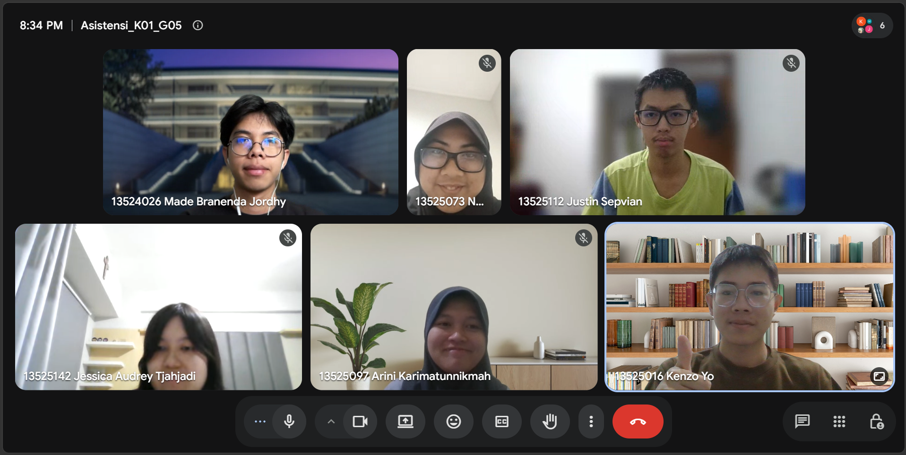

# Form Asistensi

## Tugas Besar IF2150 - Rekayasa Perangkat Lunak

| Informasi | Keterangan |
| --- | --- |
| **Hari** | *\[Selasa\]* |
| **Tanggal** | *\[22/09/2026\]* |
| **Kelas** | *\[K01\]* |
| **Nomor Kelompok** | *\[5\]*  |
| **Nama Kelompok** | *\[Furina: Forum RPL Indonesia Jaya\]*  |
| **Nama Perangkat Lunak** | *\[APATIS: Aplikasi Pelaporan Air dan Sanitasi\]*  |
| **Dokumen** | *\[K01_G05_CD\]*  |

### Anggota Kelompok

| NIM | Nama |
| --- | --- |
| *13525016* | *Kenzo Yo* |
| *13525112* | *Justin Sepvian* |
| *13525142* | *Jessica Audrey Tjahjadi* |
| *13525073* | *Nadia Layla Safira* |
| *13525097* | *Arini Karimatunnikmah* |

### Catatan

| Catatan |
| --- |
| 1. *Menurut kakak posisi admin sama petugas di UC02 itu udah oke belum? Jawab: Boleh dibiarin aja*  |
| 2. *Buat diagramnya udah aman kak? Jawab: Pastikan aja setiap boundary sama entity itu wajib dihubungi sama controller ya, sama wajib ada satu dari masing-masing. Terus nama-nya diubah biar ga ada spasi dan dibuat konsisten, biar jelas kalau dia Entity ada nama Entitynya di akhir misalnya* |
| 3. *Diagram keseluruhan itu gimana ya buatnya kak? Jawab: Di hold dulu yak nanti dijelaskan lagi Tapi intinya buat tanpa duplicate dan garisnya kalau bisa jangan intersect* |
| 4. *Pas kemarin lagi bersihin format, itu ada copy paste gitu dan akhirnya beberapa prasyarat dan aktornya salah di UC03 dan UC04, itu kalau diubah boleh ga, dan taruh di daftar perubahan Jawab: Boleh banget* |
| 5. *Apakah yang ditaruh di daftar perubahan perlu ubah milestone lainnya? Jawab: tidak ya*|
| 6. *Perlu ada teks sama multiplicity ga di diagram? Jawab: Ga wajib tapi kalau mau boleh aja*|

**Notes for this section:**  
*Catatan dapat dituliskan dalam bentuk paragraf atau poin-poin, disesuaikan saja.* 

## Dokumentasi

<!--  -->

  

  <i>Gambar 1. Dokumentasi kegiatan asistensi.</i>

