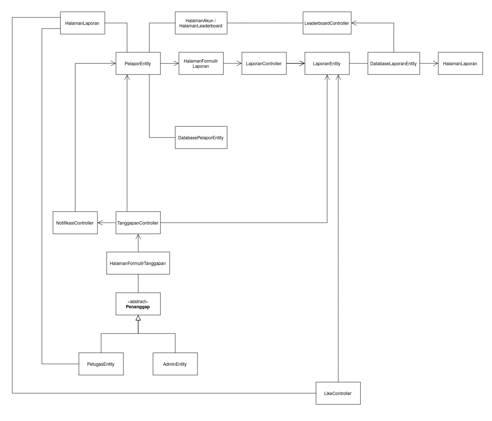

<h1>
IF2150 REKAYASA PERANGKAT LUNAK
 
TUGAS 5
 
SPESIFIKASI KEBUTUHAN PERANGKAT LUNAK (SKPL)
</h1>
 

## *APATIS: Aplikasi Pelaporan Air dan Sanitasi*

### Untuk: *Made Branenda Jordhy*

Dipersiapkan oleh:
| Informasi | Keterangan |
| --- | --- |
| Kelas | *\[Kelas K01\]* |
| Kelompok | *\[5\]*  |

| NIM | Nama |
|---|---|
| *13525016* | *Kenzo Yo* |
| *13525112* | *Justin Sepvian* |
| *13525142* | *Jessica Audrey Tjahjadi* |
| *13525073* | *Nadia Layla Safira* |
| *13525097* | *Arini Karimatunnikmah* |
---

## Daftar Perubahan

| Revisi | Deskripsi |
| :--- | :--- |
| *A* | *Deskripsikan perubahan yang dilakukan dari dokumen sebelumnya pada dokumen ini. Jika tidak terdapat perubahan, harap kosongkan tabel.* |
| *B* |  |
| *C* |  |
| ... |  |

 

# BAB 1: Pendahuluan

## 1.1 Tujuan Penulisan Dokumen
Tuliskan dengan ringkas tujuan dokumen SKPL ini dibuat dan siapa saja yang akan menggunakan dokumen ini.
Dokumen ini berisi tentang spesifikasi kebutuhan perangkat lunak (SKPL) yang selanjutnya untuk penamaan dokumen ini akan digunakan istilah SKPL. Dokumen SKPL merupakan spesifikasi kebutuhan perangkat lunak yang akan dikembangkan. Dokumen ini digunakan oleh pengembang perangkat lunak sebagai bahan acuan dalam proses pengembangan dan sebagai bahan evaluasi pada saat proses pengembangan perangkat lunak maupun diakhir pengembangannya. Dengan adanya dokumen ini diharapkan pengembangan perangkat lunak akan lebih terarah dan lebih terfokus serta tidak menimbulkan ambiguitas terutama bagi pengembang perangkat lunak. Harapannya dokumen ini juga bisa digunakan oleh pengembang perangkat lunak lain ketika pengembangan dan pemeliharaan perangkat lunak telah berpindah tangan.

## 1.2 Lingkup Masalah
Tuliskan dengan ringkas nama aplikasi dan deskripsi singkatnya. Bagian ini maksimal berisi satu paragraf, dapat diringkas dari BAB 1 *Analisis Permasalahan* pada dokumen *Topic Brainstorming*.

Fasilitas air bersih dan sanitasi di lingkungan kampus sangat penting untuk mendukung kegiatan sivitas akademika dan berkaitan langsung dengan SDGs ke-6. Namun, proses pelaporan kerusakan yang ada saat ini masih menjadi kendala karena belum terpusat, informasi lokasi sering tidak lengkap, laporan berpotensi tersebar, dan pelapor tidak mengetahui apakah masalah tersebut sudah pernah dilaporkan atau belum.

Untuk mengatasi permasalahan tersebut, diusulkan sistem terpusat bernama APATIS (Aplikasi Pelaporan Air dan Sanitasi) yang memungkinkan pengguna mencantumkan foto, deskripsi, serta lokasi kerusakan secara bertingkat. Sistem ini juga dilengkapi fitur like untuk mencegah laporan ganda serta membantu pengelola menentukan prioritas penanganan berdasarkan jumlah dukungan.

Selain itu, setiap laporan akan melalui tahapan status yang jelas (Submitted, In Progress, dan Resolved) sehingga pelapor dapat memantau perkembangannya, sementara pengguna yang mengirimkan laporan valid akan mendapatkan poin XP dan ditampilkan pada leaderboard serta memeroleh merchandise sebagai bentuk apresiasi.

## 1.3 Definisi, Istilah, dan Singkatan
Semua definisi dan singkatan yang digunakan dalam dokumen ini beserta penjelasannya.

Tabel 1.3. Definisi Istilah dan Singkatan

| Singkatan, Akronim, atau Istilah | Penjelasan |
| :--- | :--- |
| *P/L* | *Singkatan dari Perangkat Lunak, yaitu aplikasi yang memberikan perintah kepada komputer untuk menjalankan tugas tertentu.* |
| *SKPL* | *Singkatan dari Spesifikasi Kebutuhan Perangkat Lunak, yaitu dokumen yang merangkum kriteria-kriteria yang diperlukan untuk membangun aplikasi menjalankan tugasnya.* |
| *KF* | *Singkatan dari Kebutuhan Fungsional.* |
| *KNF* | *Singkatan dari Kebutuhan Non-Fungsional.* |
| *UC* | *Singkatan dari Use Case.* |
| *EARS* | *Easy Approach to Requirements Syntax, yaitu pola penulisan kebutuhan agar konsisten dan mudah diuji.* |

## 1.4 Aturan Penomoran
Tuliskan aturan penomoran (ID) yang digunakan dalam dokumen ini. Gunakan pola ID yang **sama** dengan yang sudah dipakai pada dokumen-dokumen sebelumnya, jangan membuat pola baru di dokumen ini.

Tabel 1.4. Aturan Penomoran

| Hal/Bagian | Penomoran | Keterangan |
| :--- | :--- | :--- |
| *Kebutuhan Fungsional* | *KFXX* | *Menunjukkan kebutuhan fungsional perangkat lunak.* |
| *Kebutuhan Non-Fungsional* | *KNFXX* | *Menunjukkan kebutuhan non-fungsional perangkat.* |
| *Aktor* | *AXX* | *Menunjukkan aktor-aktor yang akan menggunakan perangkat lunak.* |
| *Use Case* | *UCXX* | *Menunjukkan kegunaan perangkat lunak dari perspektif pengguna.* |
| *Kelas* | *CXX* | *Menunjukkan kelas-kelas pada perangkat lunak.* |

## 1.5 Referensi
Dokumentasi P/L yang dirujuk oleh dokumen ini. Referensi dapat berupa buku, panduan, ataupun dokumentasi lain yang dipakai dalam pengembangan P/L ini.

## 1.6 Deskripsi Umum Dokumen (Ikhtisar)
**BAB 1. Pendahuluan** : Berisi tujuan penulisan dokuman, lingkup masalah, definisi, istilah, singkatan, aturan penomoran, serta referensi.

**BAB 2. Deskripsi Perangkat Lunak** : Berisi deskripsi umum sistem dan perangkat lunak, pengguna dan kebutuhan pengguna, serta batasan dan lingkup operasi perangkat lunak.

**BAB 3. Deskripsi Kebutuhan Perangkat Lunak** : Berisi kebutuhan fungsional dan non-fungsional pada berdasarkan kebutuhan pengguna.

**BAB 4. Pemodelan Use Case** : Berisi identifikasi aktor dan use case berdasarkan kebutuhan fungsional, diagram use case, dan skenario use case.

**BAB 5. Pemodelan Kelas** : Berisi identifikasi kelas berdasarkan use case, diagram setiap use case menggunakan kelas, serta diagram kelas keseluruhan.

**BAB 6. Traceability** : Berisi tabel terkait penyocokkan kelas dengan use case dan kebutuhan fungsional.

# BAB 2: Deskripsi Perangkat Lunak

## 2.1 Deskripsi Umum Sistem
Bagian ini dapat disalin dari BAB 1.1 *Deskripsi Umum Sistem* pada dokumen *Requirement Gathering*, disesuaikan bila ada perubahan alur bisnis. Lengkapi dengan gambaran proses bisnis dalam bentuk *Activity Diagram* (boleh disalin dan diperbarui dari 3.3 *Model Proses Bisnis* pada dokumen *Topic Brainstorming*).

<i>Gambar 1. Swimlane Diagram APATIS</i>

## 2.2 Deskripsi Umum Perangkat Lunak
Diisi dengan deskripsi umum perangkat lunak untuk mendukung proses bisnis yang telah diuraikan pada sub-bab sebelumnya. Uraian harus menunjukkan lingkup perangkat lunak, mencakup keterkaitan perangkat lunak dengan sistem lain di luar (misalnya *Payment Gateway* atau layanan pihak ketiga lain yang dipakai).

*Contoh narasi:* "*[Nama P/L]* merupakan aplikasi *[deskripsi singkat]* yang berinteraksi dengan *Payment Gateway (dummy)* untuk memproses otorisasi pembayaran. Sistem menerima input dari *Pelanggan* melalui antarmuka aplikasi dan mengirimkan permintaan transaksi ke *Payment Gateway* setiap kali pelanggan melakukan checkout."

APATIS: Aplikasi Pelaporan Air dan Sanitasi adalah perangkat lunak yang memusatkan seluruh pelaporan dan penanganan terkait permasalahan air dan sanitasi di lingkup ITB. Oleh karena itu, untuk menjamin keterpusatan aplikasi tersebut, diperlukan suatu layanan _hosting_ website serta _database_ atau basis data yang dapat mencakup seluruh pengguna di ITB.

Sebagai perangkat lunak yang mengedepankan kemudahan akses, maka diperlukan website yang dapat melayani pengguna ITB dengan baik dan lancar. Hal tersebut memerlukan adanya _hosting_ website dari layanan pihak ketiga yang memiliki _server_ atau alat pemrosesan yang baik.

Selanjutnya, pada saat pembuatan laporan, sistem akan mengirim data laporan yang dibuat pengguna dari website ke sistem basis data untuk disimpan. Lalu, ketika terdapat program yang memerlukan data tersebut, sistem perlu akses basis data dengan cepat dan baik. Karena jumlah data yang ditampung berukuran besar, diperlukan sistem basis data layanan ketiga.

## 2.3 Pengguna dan Kebutuhan Pengguna Perangkat Lunak
Tuliskan seluruh jenis pengguna (*role*/aktor) yang terlibat dalam perangkat lunak (P/L), beserta kebutuhannya secara umum. Bagian ini dapat disalin dari 1.2 *Deskripsi Pengguna Perangkat Lunak* (dokumen Requirement Gathering) atau 3.1 *Identifikasi Aktor* (dokumen Use Case), pastikan sudah konsisten dengan aktor final yang dipakai di BAB 4.

| Pengguna | Kebutuhan |
| :--- | :--- |
| *Pelapor* | *aa* |
| *Petugas* | *aa* |
| *Admin* | *aa* |

## 2.4 Batasan Perangkat Lunak
Batasan yang harus dituliskan, di antaranya:
1. *P/L harus memakai file data/API dari sistem lain (sebutkan, misal Payment Gateway dummy).*
2. *P/L harus memakai format data yang sama dengan sistem lain.*
3. *P/L harus berfungsi pada platform tertentu (misal: web browser modern, atau desktop Windows dan Linux).*
4. *...*
Perangkat lunak (P/L) ini memiliki beberapa batasan, yakni sebagai berikut.
1. *P/L harus bersifat _platform independent_, yakni dapat berjalan di web browser modern apa pun*
2. *P/L harus bersifat "ringan", dalam artian perangkat dengan performa lemah dapat menggunakan P/L dengan baik*
3. *P/L harus memiliki sistem basis data eksternal, yakni untuk menyimpan data relasional sederhana seperti akun pengguna*
4. *P/L harus memiliki penyimpanan objek atau _Object Storage_ untuk menyimpan data berukuran besar seperti foto*
4. *P/L harus menggunakan layanan _hosting_ server, seperti Cloudflare Worker, untuk memastikan P/L dapat diakses banyak pengguna*
5. *P/L harus menggunakan sistem basis data PostgreSQL agar dapat menerima banyak operasi data dari banyak pengguna*
6. *P/L harus menggunakan ORM atau _Object-Relational Mapping_ untuk mempermudah manajemen database selama pengembangan dan keberjalanan P/L*
7. *P/L harus menggunakan AuthJS atau layanan autentikasi lainnya yang dapat mengirimkan _One Time Password_ (OTP) pada email pengguna ketika login*

## 2.5 Lingkungan Operasi Perangkat Lunak
Spesifikasi *operating system* atau lingkungan yang dibutuhkan P/L untuk beroperasi. Bagian ini digunakan untuk memastikan pengguna memiliki spesifikasi yang cukup untuk menjalankan P/L. Misalnya mencakup komponen server, client, OS, DBMS, tetapi tidak menutupi kemungkinan komponen lain.

| Komponen | Spesifikasi |
| :--- | :--- |
| *Server* | *Cloudflare* |
| *Client* | *Web Browser modern, seperti Chrome, Firefox terbaru, dan lain-lain* |
| *DBMS* | *PostgreSQL 15* |
| *OS* | *Cross-platform (Windows/Linux/MacOS) melalui browser* |

---

# BAB 3: Deskripsi Kebutuhan Perangkat Lunak

## 3.1 Kebutuhan Fungsional (KF)
Salin ulang **seluruh Kebutuhan Fungsional (KF)** versi terbaru dari BAB 2.1 dokumen *Class Diagram* (sudah versi final dan sudah memakai format EARS). Pastikan ID Kebutuhan (kolom "ID Kebutuhan") juga konsisten dengan ID pada tabel Pemetaan Kebutuhan di dokumen *Requirement Gathering*.

Tabel 3.1. Kebutuhan Fungsional

| ID KF | ID Kebutuhan | Penjelasan |
| :--- | :--- | :--- |
| *KF01* | *R02* | *Sistem harus memasukan pengguna ke dalam akun yang benar dan mengakses fitur yang sesuai peran yang telah terdaftar.* |
| *KF02* | *R03* | *Sistem harus dapat mengidentifikasi setiap akun sesuai perannya, yaitu Pelapor, Petugas, atau Admin.* |
| *KF03* | *R05* | *Ketika pengguna ingin melapor, sistem harus memperbolehkan pengguna untuk membuat laporan dan mencantum kategori, deskripsi, foto, waktu, dan lokasi masalah mengenai fasilitas air dan/atau sanitasi.* |
| *KF04* | *R10* | *Sistem harus mengizinkan Admin dan Petugas untuk melihat, memvalidasi, lalu menerima atau menolak laporan.* |
| *KF05* | *R11* | *Ketika sebuah laporan dinyatakan valid oleh Petugas, sistem harus memperbolehkan pengguna untuk melihat laporan tersebut di halaman utama atau feed dengan isinya, seperti detail foto, deskripsi, lokasi, waktu, status, dan jumlah _like_.* |
| *KF06* | *R12* | *Selama sebuah laporan dinyatakan valid, sistem harus memperbolehkan pengguna untuk memberikan dan membatalkan _like_ pada laporan tersebut.* |
| *KF07* | *R13* | *Bila seorang pengguna memberikan lebih dari satu _like_ di sebuah laporan, maka sistem harus membatasi agar hanya dapat memberi satu like pada laporan yang sama.* |
| *KF08* | *R14* | *Sistem harus memperbarui jumlah like setelah tindakan pengguna berhasil diproses, yaitu memberi atau membatalkan _like_.* |
| *KF09* | *R15* | *Sistem harus memperbolehkan Petugas untuk mengubah status laporan sesuai dengan perkembangan penanganannya.* |
| *KF10* | *R16* | *Ketika laporan dinyatakan valid oleh Petugas atau Admin, sistem harus dapat memberi pemilik laporan sebuah poin.* |
| *KF11* | *R17* | *Ketika laporan dinyatakan valid oleh Petugas atau Admin, sistem harus menunjukkan poin pengguna menambah.* |
| *KF12* | *R18* | *Sistem harus membatasi informasi yang ditampilkan di leaderboard, seperti peringkat dan total poin pengguna sendiri serta nama, peringkat, dan total poin semua pengguna dalam top 20.* |
| *KF13* | *R20* | *Sistem harus dapat menunjukkan calon penerima merchandise pada akhir bulan, yaitu pelapor yang top 20.* |
| *KF14* | *R21* | *Ketika sudah akhir bulan, sistem harus menghitung dan menampilkan hasil top 20 di leaderboard.* |

## 3.2 Kebutuhan Non-Fungsional (KNF)
Salin ulang Kebutuhan Non-Fungsional dari BAB 2.5 dokumen *Requirement Gathering*, sesuaikan ID Kebutuhan (kolom "ID Kebutuhan") apabila terjadi perubahan penomoran pada BAB 3.1 di atas.

Tabel 3.2. Kebutuhan Non-Fungsional

| ID KNF | ID Kebutuhan | Parameter | Deskripsi Kebutuhan |
| :--- | :--- | :--- | :--- |
| *KNF01* | *R01* | *Portability* | *Ketika pengguna ingin melapor dengan mengakses sistem APATIS, sistem dapat mengarahkan pengguna untuk masuk dengan mudah dan cepat serta menampilkan tampilan antarmuka yang sesuai dan memproses input secara konsisten meskipun melalui berbagai macam browser.* |
| *KNF02* | *R04* | *Response time* | *Ketika pengguna mencoba untuk masuk ke sistem APATIS, sistem melakukan verifikasi pengguna dan menampilkan keterangan berhasil atau gagal selambat-lambatnya 5 detik setelah pengajuan login dilakukan.* |
| *KNF03* | *R07* | *Response time* | *Ketika pengguna mengirimkan laporan, sistem harus bisa menampilkan keterangan sukses atau gagal selambat-lambatnya 3 detik setelah laporan dikirim.* |
| *KNF04* | *R08* | *Availability* | *Sistem harus selalu beroperasi secara kontinu dengan minimal tingkat ketersediaan (uptime) sebesar 99%, kecuali pada saat jadwal pemiliharaan sistem .* |
| *KNF05* | *R09* | *Security* | *Jika pengguna mengunggah file selain JPEG/PNG atau ukuran file melebihi 10 MB, maka sistem harus menolak unggahan tersebut dan menampilkan pesan kesalahan kepada pengguna. Hal ini diperlukan untuk mencegah pengguna mengunggah file berbahaya.* |
| *KNF06* | *R19* | *Security* | *Sistem harus menampilkan informasi pengguna pada leaderboard yang hanya terbatas pada nama pengguna (username) dan total perolehan poin pelaporan. Saat halaman leaderboard dimuat oleh pengguna, sistem harus menyembunyikan seluruh data pribadi pengguna.* |
| *KNF07* | *R22* | *Performance efficiency* | *Sistem harus memperbarui data peringkat pada leaderboard setiap 5 detik. Saat waktu memasuki pukul 00.00 WIB pada hari pertama setiap bulan kalender, sistem harus mengatur ulang (reset) seluruh akumulasi skor pada leaderboard ke angka nol.* |

*Silakan pilih parameter yang relevan dengan P/L kalian (Availability, Reliability, Ergonomy, Portability, Memory, Response time, Safety, Security, dsb), tidak perlu semua parameter diisi. Lihat kembali dokumen Requirement Gathering untuk penjelasan tiap parameter.*

---

# BAB 4: Pemodelan Use Case

## 4.1 Identifikasi Aktor
Salin ulang daftar aktor final dari BAB 3.1 dokumen *Use Case & Scenario Use Case* atau *Class Diagram*. Tambahkan ID Aktor mengikuti Aturan Penomoran pada 1.4.

| ID Aktor | Aktor | Deskripsi |
| :--- | :--- | :--- |
| *A01* | *Pelapor* | *Pengguna eksternal yang melaporkan kerusakan fasilitas air dan sanitasi sehingga memperoleh poin serta melihat dan memberikan like atau unlike pada laporan kerusakan fasilitas air dan sanitasi dalam sistem APATIS yang telah dilaporkan pengguna lain.* |
| *A02* | *Petugas* | *Pengguna yang menanggapi laporan yang masuk, menentukan dan memberikan status apakah laporan tersebut merupakan kersusakan pada fasilitas air dan sanitasi atau bukan, serta memberikan status pada laporan telah dituntaskan.* |
| *A03* | *Admin* | *Pengguna yang mengelola validitas laporan secara administratif serta memberikan catatan pada kekurangan laporan.* |

## 4.2 Identifikasi Use Case
Salin ulang daftar Use Case versi terbaru dari BAB 3.2 dokumen *Class Diagram*, pastikan seluruh ID KF yang dirujuk sudah sesuai dengan tabel pada 3.1.

| ID UC | Nama Use Case | Deskripsi Singkat | Aktor | ID KF |
| :--- | :--- | :--- | :--- | :--- |
| *UC01* | *Melakukan pelaporan* | *Pengguna melakukan pelaporan terkait masalah air dan/atau sanitasi yang ditemukan. Pengguna mengisi formulir laporan dengan menggunggah bukti pendukung beserta deskripsi masalah. Laporan akan diterima oleh petugas dan admin untuk diproses validitasnya terlebih dahulu. Laporan yang valid akan diproses penanganannya dan laporan yang tidak valid akan ditolak dengan tanggapan.* | *Pelapor* | *KF01, KF02, KF03, KF04* |
| *UC02* | *Memberikan status laporan* | *Petugas dan admin mampu memberikan status laporan berupa penerimaan, penolakan, dan progres yang dapat disertai dengan tanggapan. Status laporan dapat disunting kapan saja oleh petugas dan admin. Status laporan dapat dilihat kapan saja oleh pengguna, baik yang dibuat sendiri dan yang dibuat oleh pengguna lain.* | *Petugas, Admin* | *KF04, KF09, KF05* |
| *UC03* | *Memberi dan membatalkan like* | *Pengguna dapat memberikan like pada laporan yang dirasa perlu diprioritaskan, baik laporan yang dibuat sendiri dan yang dibuat oleh pengguna lain. Apabila pengguna memiliki pendapat yang berbeda setelah memberikan like, pengguna dapat membatalkan like tersebut. Petugas dapat mengetahui daftar prioritas dari masalah yang dilaporkan.* | *Pelapor, Petugas* | *KF05, KF06, KF07, KF08* |
| *UC04* | *Memperoleh poin* | *Pengguna akan memperoleh poin untuk setiap laporan yang telah dinyatakan valid oleh petugas dan admin. Poin yang diperoleh dapat dilihat pada akunnya sendiri atau pada leaderboard.Melalui leaderboard, pengguna dapat mengetahui peringkatnya sendiri dan pengguna yang menempati peringkat 20 ke atas. Pengguna yang menempati peringkat 20 ke atas pada akhir bulan akan mendapatkan merchandise sesuai dengan peringkatnya.* | *Pelapor* | *KF10, KF11, KF12, KF13, KF14* |

## 4.3 Use Case Diagram
Salin ulang Use Case Diagram dari BAB 3.3 dokumen *Use Case & Scenario Use Case* atau *Class Diagram* (gunakan versi paling akhir/terbaru apabila terdapat perubahan).

<i>Gambar 2. Use Case Diagram APATIS</i>

## 4.4 Skenario Use Case
Salin ulang skenario **setiap** use case (skenario normal dan alternatif) dari BAB 3.4 dokumen *Use Case & Scenario Use Case*, sesuaikan dengan daftar UC final pada 4.2. Jika use case melibatkan lebih dari satu aktor manusia yang benar-benar berinteraksi langsung (misalnya *Kasir* yang memverifikasi transaksi setelah *Pelanggan* membayar), tambahkan kolom aksi tersendiri untuk aktor tersebut di samping kolom "Reaksi Perangkat Lunak". Sistem eksternal otomatis seperti *payment gateway* **bukan aktor**, sehingga interaksinya cukup dituliskan sebagai bagian dari "Reaksi Perangkat Lunak", bukan kolom aktor terpisah.

### 4.4.1 Skenario UC01

**Nama Use Case:** *Melaporkan Masalah Fasilitas Air atau Sanitasi di ITB*

**Skenario Normal**

| No | Aksi Aktor | Reaksi Perangkat Lunak |
| :--- | :--- | :--- |
| 1 | *Pelapor menekan tombol lapor* ||
| 2 || *Sistem menampilkan halaman laporan yang berisi formulir laporan* |
| 3 | *Pelapor mengisi formulir laporan dengan lengkap* ||
| 4 || *Sistem menerima data dari kolom-kolom yang diisi pelapor pada _front-end_ atau antarmuka dan secara bersamaan melakukan validasi teknis (misal, jumlah karakter deskripsi laporan, jenis file foto)* |
| 5 | *Pelapor mengonfirmasi pengiriman laporan* ||
| 6 || *Sistem menerima data formulir laporan dan mengirimnya ke database sebagai daftar laporan untuk ditanggapi Petugas atau Admin* |

**Skenario Alternatif 1: Laporan Tidak Valid Secara Teknis**

| No | Aksi Aktor | Reaksi Perangkat Lunak |
| :--- | :--- | :--- |
| 1 | *Pelapor menekan tombol lapor untuk membuat laporan* ||
| 2 || *Sistem menampilkan halaman formulir laporan* |
| 3 | *Pelapor mengisi formulir laporan, tetapi salah satu aspek teknis laporan (misal, jumlah karakter tidak melebihi batas, jenis file foto sesuai, dan kolom yang wajib diisi terisi semua) tidak terpenuhi* |
| 4 || *Sistem menampilkan pesan _error_ yang sesuai dengan aspek teknis yang tidak terpenuhi* |
| 5 | *Pelapor menyesuaikan laporannya* ||
| 6 || *Sistem kembali ke langkah 2 skenario normal* |

### 4.4.2 Skenario UC02

**Nama Use Case:** *Memberikan Status Laporan*

**Skenario Normal**

| No | Aksi Aktor | Reaksi Perangkat Lunak |
| :--- | :--- | :--- |
| 1 | *Petugas membuka daftar laporan* ||
| 2 || *Sistem menampilkan seluruh laporan beserta status laporan tersebut* |
| 3 | *Petugas mengubah status salah satu laporan (misal, penerimaan, penolakan, dan _progress_ berupa tanggapan)* ||
| 4 || *Sistem memperbarui data status laporan pada _front-end_ atau antarmuka untuk dikirim nantinya* |
| 5 | *Petugas menekan tombol untuk mengirim perubahan status laporan* ||
| 6 || *Sistem mengirimkan data perubahan status laporan ke basis data* |
| 7 || *Sistem mengirimkan notifikasi perubahan laporan ke pelapor yang berkaitan* | 
| 8 || *Sistem memberi poin jika laporannya diterima, sebaliknya laporan dihapus jika ditolak* |

**Skenario Alternatif 1: Admin Melakukan Validasi Administratif / Moderasi**

| No | Aksi Aktor | Reaksi Perangkat Lunak |
| :--- | :--- | :--- |
| 1 | *Admin membuka daftar laporan* ||
| 2 || *Sistem menampilkan daftar laporan beserta status dari laporan tersebut* |
| 3 | *Admin mengubah salah satu status laporan karena alasan administratif, seperti laporan yang tidak senonoh, spam, laporan palsu, dan sebagainya* ||
| 4 || *Sistem memperbarui data status laporan pada _front-end_ atau antarmuka untuk dikirim nantinya* |
| 5 | *Admin menekan tombol untuk mengirim perubahan status laporan* ||
| 6 || *Sistem mengirimkan data perubahan status laporan ke basis data* |
| 7 || *Sistem mengirimkan notifikasi perubahan laporan ke pelapor yang berkaitan* | 
| 8 || *Sistem memberi poin jika laporannya diterima, sebaliknya laporan dihapus jika ditolak* |

### 4.4.3 Skenario UC03

**Nama Use Case:** *Memberikan dan Membatalkan _Like_*  

**Skenario Normal**

| No | Aksi Aktor | Reaksi Perangkat Lunak |
| :--- | :--- | :--- |
| 1  | *Pelapor melihat daftar laporan pada halaman utama APATIS.* ||
| 2  || *Sistem menampilkan laporan yang telah dinyatakan valid beserta jumlah like pada setiap laporan.*|
| 3  | *Pelapor menekan tombol like pada salah satu laporan.* ||
| 4  || *Sistem memeriksa bahwa Pelapor belum pernah memberikan like pada laporan tersebut.* |
| 5  | *Pelapor menunggu proses pemberian like.* ||
| 6  || *Sistem menyimpan like, menambah jumlah like sebanyak satu, dan menampilkan tombol like di laporan dalam keadaan aktif.*  |

**Skenario Alternatif 1: Membatalkan Like**

| No | Aksi Aktor | Reaksi Perangkat Lunak |
| :--- | :--- | :--- |
| 1  | *Pelapor melihat daftar laporan yang sebelumnya telah diberi like.* ||
| 2  || *Sistem menampilkan tombol like dalam keadaan aktif.*|
| 3  | *Pelapor menekan kembali tombol like pada laporan tersebut.* ||
| 4  || *Sistem menghapus like yang sebelumnya diberikan oleh Pelapor.* |
| 5  | *Pelapor menunggu proses pembatalan like.* ||
| 6  || *Sistem mengurangi jumlah like sebanyak satu dan menampilkan tombol like dalam keadaan tidak aktif.*  |

### 4.4.4 Skenario UC04

**Nama Use Case:** *Memperoleh Poin*  

**Skenario Normal**

| No | Aksi Aktor | Reaksi Perangkat Lunak |
| :--- | :--- | :--- |
| 1  | *Pelapor menunggu laporan diproses.* ||
| 2  || *Sistem menampilkan laporan kepada Admin atau Petugas untuk divalidasi.*|
| 3  | *Pelapor menunggu hasil validasi laporan.* ||
| 4  || *Sistem mencatat bahwa laporan telah divalidasi dan diterima oleh Admin atau Petugas.* |
| 5  | *Pelapor menerima pemberitahuan bahwa laporannya telah diterima.* ||
| 6  || *Sistem memberikan poin kepada Pelapor dan memperbarui jumlah poin pada akun Pelapor.*  |

**Skenario Alternatif 1: Laporan Tidak Lolos Validasi oleh Admin atau Petugas**

| No | Aksi Aktor | Reaksi Perangkat Lunak |
| :- | :--------- | :--------------------- |
| 1  | *Pelapor menunggu laporan diproses.* ||
| 2  || *Sistem menampilkan laporan kepada Admin atau Petugas untuk divalidasi.*|
| 3  | *Pelapor menunggu hasil validasi laporan.* ||
| 4  || *Sistem mencatat bahwa laporan tidak lolos validasi oleh Admin atau Petugas.* |
| 5  | *Pelapor menerima pemberitahuan bahwa laporannya tidak diterima.* ||

*Lanjutkan pola 4.4.x ini untuk setiap ID UC pada 4.2, sampai seluruh use case memiliki skenarionya masing-masing.*

---

# BAB 5: Pemodelan Kelas

## 5.1 Identifikasi Kelas
Salin ulang seluruh kelas yang telah diidentifikasi dari BAB 4.1 dokumen *Class Diagram*.

| ID Kelas | Nama Kelas | Deskripsi Kelas | ID Use Case |
| :--- | :--- | :--- | :--- |
| *C01* | *PelaporEntity* | *Menyimpan data akun pelapor yang membuat nama dan NIM/NIP bagi civitas akademika ITB.* | *UC01, UC02, UC03, UC04* |
| *C02* | *LaporanEntity* | *Menyimpan data laporan berupa deskripsi masalah, lokasi, bukti foto, status tombol like dan banyak like-nya, beserta status validitasnya secara administrasi dan status penanganannya.* | *UC01, UC02, UC03* |
| *C03* | *HalamanLaporan* | *Menampilkan seluruh laporan terurut dari laporan dengan like terbanyak dari pengguna lain yang telah disetujui admin dan petugas dilengkapi dengan tombol untuk memberikan like serta tombol untuk mulai membuat laporan bagi pelapor. Selain itu, tombol tanggapan bagi admin dan petugas.* | *UC03* |
| *C04* | *HalamanFormulirLaporan* | *Menerima input pelapor berupa deskripsi masalah, lokasi, dan bukti pendukung. Pada bagian ini juga terdapat tombol konfirmasi untuk mengirimkan laporan. Pada masing-masing bentuk input terdapat validasi teknis yang harus dipenuhi seperti maksimal karakter dan maksimal ukuran foto, jika tidak memenuhi validasi teknis ini halaman akan menampilkan pesan kesalahan.* | *UC01* |
| *C05* | *LaporanController* | *Mengarahkan pelapor untuk membuat laporan dari tombol lapor hingga keterangan berhasil atau gagal.* | *UC01* |
| *C06* | *AdminEntity* | *Menyimpan data akun admin yang memuat nama, NIP, dan sebagainya.* | *UC02* |
| *C07* | *PetugasEntity* | *Menyimpan data akun petugas yang memuat nama, NIP, dan sebagainya.* | *UC02, UC03* |
| *C08* | *HalamanFormulirTanggapan* | *Hanya ada pada akun admin dan petugas. Menerima input dari admin berupa pilihan untuk terima, tolak, atau ditangguhkan sebuah laporan berdasarkan administratif dan/atau petugas berupa berkaitan atau tidaknya laporan dengan masalah air dan sanitasi ITB serta status belum ditangani, dalam penanganan, atau tuntasnya sebuah laporan, catatan, serta tombol kirim.* | *UC02* |
| *C09* | *TanggapanController* | *Mengarahkan pengguna untuk memberikan tanggapan dimulai dari membuka laporan yang ingin ditanggapi hingga muncul pesan berhasil terkirim. Kelas ini juga mengatur penambahan poin pada laporan yang valid.* | *UC02, UC04* |
| *C10* | *LikeController* | *Mengatur pemberian like dan pembatalan like oleh pengguna.* | *UC03* |
| *C11* | *HalamanLeaderboard* | *Menampilkan perolehan 20 pelapor dengan poin terbanyak, serta menampilkan peringkat dan jumlah poin pemilik akun.* | *UC04* |
| *C12* | *DatabaseLaporanEntity* | *Menyimpan data formulir laporan yang telah dikirim berupa deskripsi  masalah, lokasi, dan bukti foto baik yang sudah divalidasi maupun yang belum.* | *UC01, UC02, UC03* |
| *C13* | *DatabasePelaporEntity* | *Menyimpan data diri pelapor termasuk jumlah poin yang dimiliki.* | *UC04* |
| *C14* | *LeaderboardController* | *Mengarahkan pengguna untuk melihat perolehan poin yang ia miliki.* | *UC04* |
| *C15* | *HalamanAkun* | *Menampilkan data akun pelapor yang membuat nama dan NIM/NIP bagi civitas akademika ITB serta perolehan poin yang dimiliki.* | *UC04* |
| *C16* | *HalamanNotifikasi* | *Menampilkan laporan pengguna yang telah disetujui admin dan/atau petugas.* | *UC02, UC04* |
| *C17* | *NotifikasiController* | *Mengarahkan pengguna pada halaman tempat laporannya disetujui atau tidak.* | *UC02, UC04* |

## 5.2 Diagram Kelas per Use Case
Salin ulang diagram kelas untuk setiap use case dari BAB 4.2 dokumen *Class Diagram*, lengkap dengan tabel atribut dan metode/operasinya.

### 5.2.1 Use Case UC01

**Nama Use Case:** *Melakukan pelaporan*

<i>Gambar 3. Diagram Kelas Use Case UC01</i>

| ID Kelas | Nama Kelas | Atribut | Metode/Operasi |
| :--- | :--- | :--- | :--- |
| *C01* | *PelaporEntity* | *idPelapor, namaPelapor, nimnipPelapor, poinPelapor* | *getIdPelapor(), getNamaPelapor(), getNimNipPelapor(), getPoinPelapor(), setIdPelapor(), setNamaPelapor(), setNimNipPelapor(), setPoinPelapor()* |
| *C02* | *LaporanEntity* | *idLaporan, descLaporan, fotoLaporan, likeLaporan, statusLaporan* | *getIdLaporan(), getDescLaporan(), getFotoLaporan(), getLikeLaporan(), getStatusLaporan(), setIdLaporan(), setDescLaporan(), setFotoLaporan(), setLikeLaporan(), setStatusLaporan()* |
| *C04* | *HalamanFormulirLaporan* | *maxKarakter, maxUkuranFoto, laporanValid* | *isJumlahKarakterValid(), isUkuranFotoValid(), isLaporanValid()* |
| *C05* | *LaporanController* | *laporanValid* | *isLaporanValid(), setStatusLaporan(), getValidLaporan()* |
| *C12* | *DatabaseLaporanEntity* | *daftarLaporan* | *getLaporanData(), setLaporanData(), insertNewLaporan()* |

### 5.2.2 Use Case UC02

**Nama Use Case:** *Memberikan status laporan*

<i>Gambar 4. Diagram Kelas Use Case UC02</i>

| ID Kelas | Nama Kelas | Atribut | Metode/Operasi |
| :--- | :--- | :--- | :--- |
| *C06* | *AdminEntity* | *idAdmin, namaAdmin, nipAdmin* | *getIdAdmin(), getNamaAdmin(), getNipAdmin(), setIdAdmin(), setNamaAdmin(), setNipAdmin()* |
| *C07* | *PetugasEntity* | *idPetugas, namaPetugas, nipPetugas* | *getIdPetugas(), getNamaPetugas(), getNipPetugas(), setIdPetugas(), setNamaPetugas(), setNipPetugas()* |
| *C08* | *HalamanFormulirTanggapan* | *statusLaporan, statusTuntasLaporan* | *getStatusLaporan(), getStatusTuntasLaporan(), setStatusLaporan(), setStatusTuntasLaporan()* |
| *C09* | *TanggapanController* | *newStatusLaporan* | *addPoinPelapor(), setStatusLaporan(), sendTanggapan()* |
| *C12* | *DatabaseLaporanEntity* | *daftarLaporan* | *getLaporanData(), setLaporanData(), insertNewLaporan()* |
| *C16* | *HalamanNotifikasi* | *listNotifikasi* | *showListNotifikasi()* |
| *C17* | *NotifikasiController* | *statusNotifikasi* | *createNotifikasi(), sendNotifikasi()* |

### 5.2.2 Use Case UC03

**Nama Use Case:** *Memberikan status laporan*

<i>Gambar 5. Diagram Kelas Use Case UC03</i>

| ID Kelas | Nama Kelas | Atribut | Metode/Operasi |
| :--- | :--- | :--- | :--- |
| *C01* | *PelaporEntity* | *idPelapor, namaPelapor, nimnipPelapor, poinPelapor* | *getIdPelapor(), getNamaPelapor(), getNimNipPelapor(), getPoinPelapor(), setIdPelapor(), setNamaPelapor(), setNimNipPelapor(), setPoinPelapor()* |
| *C02* | *LaporanEntity* | *idLaporan, descLaporan, fotoLaporan, likeLaporan, statusLaporan* | *getIdLaporan(), getDescLaporan(), getFotoLaporan(), getLikeLaporan(), getStatusLaporan(), setIdLaporan(), setDescLaporan(), setFotoLaporan(), setLikeLaporan(), setStatusLaporan()* |
| *C03* | *HalamanLaporan* | *daftarLaporan* | *createLaporan(), sortLaporan(), showLaporan()* |
| *C10* | *LikeController* | *-* | *isLaporanLiked(), likeLaporan(), unlikeLaporan()* |
| *C12* | *DatabaseLaporanEntity* | *daftarLaporan* | *getLaporanData(), setLaporanData(), insertNewLaporan()* |
| *C07* | *PetugasEntity* | *idPetugas, namaPetugas, nipPetugas* | *getIdPetugas(), getNamaPetugas(), getNipPetugas(), setIdPetugas(), setNamaPetugas(), setNipPetugas()* |

### 5.2.2 Use Case UC04

**Nama Use Case:** *Memberikan status laporan*

<i>Gambar 6. Diagram Kelas Use Case UC04</i>

| ID Kelas | Nama Kelas | Atribut | Metode/Operasi |
| :--- | :--- | :--- | :--- |
| *C01* | *PelaporEntity* | *idPelapor, namaPelapor, nimnipPelapor, poinPelapor* | *getIdPelapor(), getNamaPelapor(), getNimNipPelapor(), getPoinPelapor(), setIdPelapor(), setNamaPelapor(), setNimNipPelapor(), setPoinPelapor()* |
| *C15* | *HalamanAkun* | *pelaporData* | *showPelaporData()* |
| *C11* | *HalamanLeaderboard* | *top20Pelapor* | *sortPelaporByPoin(), show20Pelapor()* |
| *C14* | *LeaderboardController* | *-* | *getPelaporPoin(), getPelaporRank()* |
| *C13* | *DatabasePelaporEntity* | *daftarPelapor* | *updateDataPelapor()* |
| *C09* | *TanggapanController* | *newStatusLaporan* | *addPoinPelapor(), setStatusLaporan(), sendTanggapan()* |

> Lanjutkan pola **5.2.x** untuk setiap use case pada 4.2.

## 5.3 Diagram Kelas Keseluruhan
Gabungkan seluruh kelas dan hubungan antarkelas dari BAB 4.3 dokumen *Class Diagram* menjadi satu diagram kelas keseluruhan. Pastikan tidak ada kelas yang terduplikasi atau tertinggal.

<i>Gambar 7. Diagram Kelas Keseluruhan</i>

| ID Kelas | Nama Kelas | Atribut | Metode/Operasi |
| :--- | :--- | :--- | :--- |
| *C01* | *PelaporEntity* | *idPelapor, namaPelapor, nimnipPelapor, poinPelapor* | *getIdPelapor(), getNamaPelapor(), getNimNipPelapor(), getPoinPelapor(), setIdPelapor(), setNamaPelapor(), setNimNipPelapor(), setPoinPelapor()* |
| *C02* | *LaporanEntity* | *idLaporan, descLaporan, fotoLaporan, likeLaporan, statusLaporan* | *getIdLaporan(), getDescLaporan(), getFotoLaporan(), getLikeLaporan(), getStatusLaporan(), setIdLaporan(), setDescLaporan(), setFotoLaporan(), setLikeLaporan(), setStatusLaporan()* |
| *C03* | *HalamanLaporan* | *daftarLaporan* | *createLaporan(), sortLaporan(), showLaporan()* |
| *C04* | *HalamanFormulirLaporan* | *maxKarakter, maxUkuranFoto, laporanValid* | *isJumlahKarakterValid(), isUkuranFotoValid(), isLaporanValid()* |
| *C05* | *LaporanController* | *laporanValid* | *isLaporanValid(), setStatusLaporan(), getValidLaporan()* |
| *C06* | *AdminEntity* | *idAdmin, namaAdmin, nipAdmin* | *getIdAdmin(), getNamaAdmin(), getNipAdmin(), setIdAdmin(), setNamaAdmin(), setNipAdmin()* |
| *C07* | *PetugasEntity* | *idPetugas, namaPetugas, nipPetugas* | *getIdPetugas(), getNamaPetugas(), getNipPetugas(), setIdPetugas(), setNamaPetugas(), setNipPetugas()* |
| *C08* | *HalamanFormulirTanggapan* | *statusLaporan, statusTuntasLaporan* | *getStatusLaporan(), getStatusTuntasLaporan(), setStatusLaporan(), setStatusTuntasLaporan()* |
| *C09* | *TanggapanController* | *newStatusLaporan* | *addPoinPelapor(), setStatusLaporan(), sendTanggapan()* |
| *C10* | *LikeController* | *-* | *isLaporanLiked(), likeLaporan(), unlikeLaporan()* |
| *C11* | *HalamanLeaderboard* | *top20Pelapor* | *sortPelaporByPoin(), show20Pelapor()* |
| *C12* | *DatabaseLaporanEntity* | *daftarLaporan* | *getLaporanData(), setLaporanData(), insertNewLaporan()* |
| *C13* | *DatabasePelaporEntity* | *daftarPelapor* | *updateDataPelapor()* |
| *C14* | *LeaderboardController* | *-* | *getPelaporPoin(), getPelaporRank()* |
| *C15* | *HalamanAkun* | *pelaporData* | *showPelaporData()* |
| *C16* | *HalamanNotifikasi* | *listNotifikasi* | *showListNotifikasi()* |
| *C17* | *NotifikasiController* | *statusNotifikasi* | *createNotifikasi(), sendNotifikasi()* |

---

# BAB 6: Traceability
Salin ulang tabel Traceability dari BAB 5 dokumen *Class Diagram*, cocokkan setiap Kebutuhan Fungsional, Use Case, dan Kelas yang saling terkait.

| ID Kelas | ID Use Case | ID KF |
| :--- | :--- | :--- |
| **C01** | *UC01, UC02, UC03, UC04* | *KF03, KF06, KF07, KF10, KF11* |
| **C02** | *UC01, UC02, UC03* | *KF03, KF04, KF05, KF06, KF07, KF08, KF09* |
| **C03** | *UC03* | *KF05, KF06, KF08* |
| **C04** | *UC01* | *KF03* |
| **C05** | *UC01* | *KF03* |
| **C06** | *UC02* | *KF04* |
| **C07** | *UC02* | *KF04, KF09* |
| **C08** | *UC02* | *KF04, KF09* |
| **C09** | *UC02, UC04* | *KF04, KF09, KF10, KF11* |
| **C10** | *UC03* | *KF06, KF07, KF08* |
| **C11** | *UC04* | *KF11, KF12, KF13, KF14* |
| **C12** | *UC01, UC02, UC03* | *KF03, KF04, KF05, KF06, KF07, KF08, KF09* |
| **C13** | *UC04* | *KF10, KF11, KF12, KF13, KF14* |
| **C14** | *UC04* | *KF11, KF12, KF13, KF14* |
| **C15** | *UC04* | *KF11, KF12* |
| **C16** | *UC02, UC04* | *KF09, KF10, KF11* |
| **C17** | *UC02, UC04* | *KF09, KF10, KF11* |

---

# Referensi
- Diagram UML: [https://www.drawio.com/](https://www.drawio.com/), [https://staruml.io/](https://staruml.io/)
