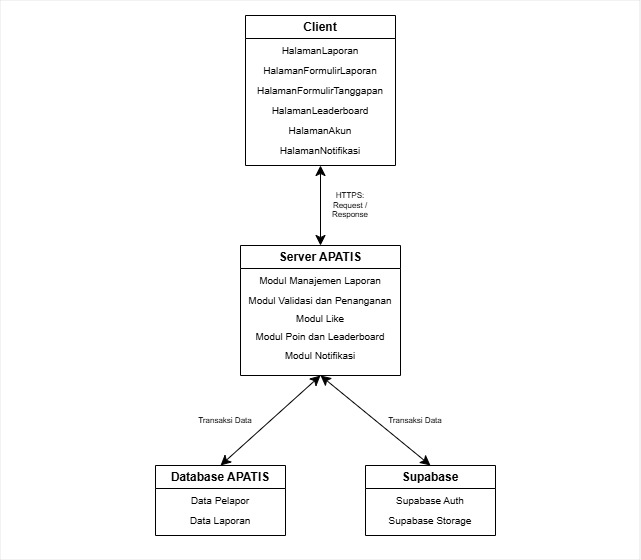
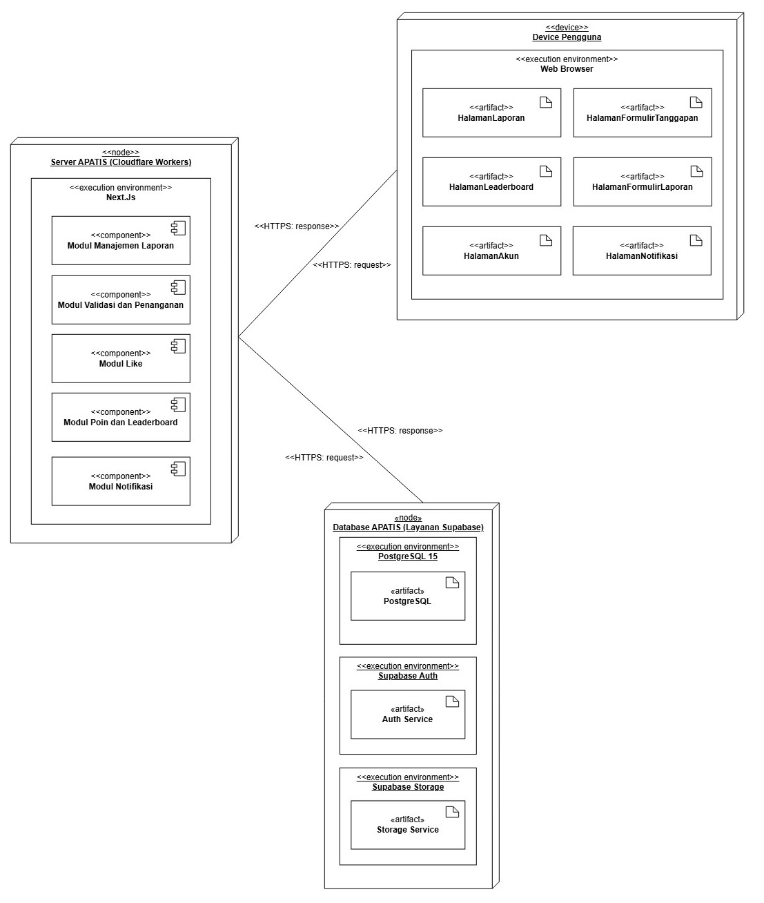

<h1>
IF2150 REKAYASA PERANGKAT LUNAK
 
TUGAS 6
 
ARSITEKTUR PERANGKAT LUNAK (APL)
</h1>
 

## *APATIS: Aplikasi Pelaporan Air dan Sanitasi*

### Untuk: *Made Branenda Jordhy*

Dipersiapkan oleh:
| Informasi | Keterangan |
| --- | --- |
| Kelas | *\[Kelas K01\]* |
| Kelompok | *\[5\]*  |
| Nama Kelompok | *\[Furina: Forum RPL Indonesia Jaya\]* |

| NIM | Nama |
|---|---|
| *13525016* | *Kenzo Yo* |
| *13525112* | *Justin Sepvian* |
| *13525142* | *Jessica Audrey Tjahjadi* |
| *13525073* | *Nadia Layla Safira* |
| *13525097* | *Arini Karimatunnikmah* |
---

 
 

# BAB 1: Style/Pattern Arsitektur Acuan

<i>Gambar 1. Arsitektur Client-Server</i>

Sistem Perangkat Lunak APATIS menggunakan gaya arsitektur *client-server*, yakni merupakan gaya dengan banyak klien atau entitas yang akan meminta dan mendapatkan data dari suatu server utama sehingga klien hanya mendapatkan antarmuka dan interaksi dengan server, sedangkan server yang akan memproses data dari klien.

Klien atau *client* pada APATIS berupa web pengguna yang dapat dijalankan pada *platform* mana pun. Klien berperan hanya untuk menangani antarmuka web, menangkap interaksi pengguna, melakukan validasi awal (validasi dari sisi klien, misalnya jumlah karakter dalam kolom laporan), dan interaksi dengan server berupa permintaan dan penerimaan HTTP.

Server pada APATIS merupakan lingkungan komputasi *serverless* tanpa server fisik dengan menggunakan Cloudflare workers. Server akan menangani pemrosesan data, logika dari sistem, serta pengiriman dan pengambilan dari basis data ke klien.

Basis data pada perangkat lunak ini akan menyimpan data-data terstruktur seperti data laporan dan data pelapor, serta data berukuran besar seperti foto pada laporan.

Gaya arsitektur *client-server* dipilih karena perangkat lunak APATIS merupakan aplikasi web yang memisahkan klien dengan server, yakni klien pada aplikasi web hanya menyediakan antarmuka dan melakukan permintaan data kepada server. Sebaliknya, server hanya menyediakan data dan pemrosesan atau operasi data yang diperlukan bagi klien. 

Arsitektur *client-server* juga dipilih karena arsitektur ini mendukung kemudahan akses bagi banyak pengguna sekaligus atau secara konkuren. Hal ini juga memungkinkan server memproses dan mengirimkan data yang konsisten kepada banyak pengguna sekaligus.

Tabel 1.1 Lingkungan Operasi Perangkat Lunak

| Komponen | Spesifikasi |
| :--- | :--- |
| *Server* | *Cloudflare Worker* |
| *Client* | *Web Browser modern, seperti Chrome, Firefox terbaru, dan lain-lain* |
| *DBMS* | *Supabase dengan PostgreSQL 15* |
| *OS* | *Cross-platform (Windows/Linux/MacOS/Android/iOS) melalui browser* |
| *Auth* | *Supabase Auth* |
| *Object Storage* | *Supabase Storage* |

Dari tabel tersebut, alasan gaya arsitektur *client-server* dipilih menjadi lebih jelas. Sisi klien berupa web yang digunakan pengguna, sedangkan server berupa Cloudflare Worker yang memungkinkan pemrosesan data secara terpusat. Lalu, *DBMS* dan *Object Storage* digunakan untuk menyimpan data terstruktur seperti data pelapor, laporan, serta data berukuran besar seperti foto. 

---

# BAB 2: Identifikasi Komponen / Modul / Subsistem

Tabel 2.1. Identifikasi Komponen/Modul/Subsistem

| Nama Komponen/Modul/Subsistem | Jenis                 | Penjelasan                                                                                                           |
| :---------------------------- | :-------------------- | :------------------------------------------------------------------------------------------------------------------- |
| *HalamanLaporan*                 | *Client*                | *Menampilkan daftar laporan dan mengirim request data laporan serta like ke server.*     |
| *HalamanFormulirLaporan*               | *Client*                | *Menerima input laporan baru dan mengirimkannya ke LaporanController.*                                                       |
| *HalamanFormulirTanggapan*                | *Client*                | *Menerima input tanggapan atas laporan dan mengirimkannya ke TanggapanController.*                                      |
| *HalamanLeaderboard*          | *Client*                | *Menampilkan peringkat yang diminta dari LeaderboardController* |
| *HalamanAkun*           | *Client*          | *Menampilkan dan mengelola data akun pengguna.*                                             |
| *HalamanNotifikasi*         | *Client*          | *Menampilkan notifikasi yang diminta dari NotifikasiController.*       |
| *Server APATIS* | *Server* | *Menerima permintaan HTTP dari Aplikasi Web APATIS, menjalankan logika aplikasi, mengatur hak akses, dan berkomunikasi dengan Database APATIS serta layanan eksternal.* |
| *Modul Manajemen Laporan* | *Server* | *Menangani validasi data, pembuatan, penyimpanan, pengambilan, dan pembaruan laporan. Modul ini mewadahi LaporanController, LaporanEntity, dan DatabaseLaporanEntity.* |
| *Modul Validasi dan Penanganan* | *Server* | *Menangani moderasi administratif oleh Admin, penerimaan atau penolakan laporan oleh Petugas, pencatatan tanggapan, dan perubahan status penanganan. Modul ini menggunakan TanggapanController serta data AdminEntity dan PetugasEntity.* |
| *Modul Like* | *Server* | *Memeriksa, menyimpan, dan membatalkan like serta memastikan seorang Pelapor hanya memiliki satu like pada setiap laporan. Modul ini mewadahi LikeController.* |
| *Modul Poin dan Leaderboard* | *Server* | *Memberikan poin untuk laporan yang memenuhi ketentuan, memperbarui poin Pelapor, menghitung peringkat, dan mengambil data 20 peringkat teratas. Modul ini mewadahi LeaderboardController serta menggunakan data PelaporEntity dan DatabasePelaporEntity.* |
| *Modul Notifikasi* | *Server* | *Membuat dan mengirimkan notifikasi ketika status laporan atau jumlah poin Pelapor berubah. Modul ini mewadahi NotifikasiController.* |
| *Database APATIS*        | *Database*          | *Menyimpan data pelapor dan laporan secara terpusat.*                |
| *Supabase Auth*           | *Layanan eksternal*          | *Menangani autentikasi pengguna.*                                                              |
| *Supabase Storage*                      | *Layanan eksternal*               | *Menyimpan berkas lampiran laporan.*                        |
| *Cloudflare Workers* | *Layanan Eksternal* | *Menyediakan lingkungan komputasi serverless untuk menjalankan Server APATIS dan menerima permintaan dari Aplikasi Web APATIS melalui internet.* |

---

# BAB 3: Model Arsitektur Perangkat Lunak

## 3.1 Physical View

Physical view dipilih karena menggambarkan pemetaan komponen perangkat lunak ke infrastruktur perangkat keras atau cloud. Aplikasi APATIS menggunakan model Client-Server Architecture. Pada model ini komponen berjalan di lingkungan secara terpisah secara fisik, yakni client yang dijalankan pengguna, server yang menjalankan logika, dan database server yang menyimpan data  sehingga deployment diagram (salah satu diagram physical view) kami nilai tepat untuk merepresentasikan model kami.

<i>Gambar 2. Physical View untuk APATIS</i>

---