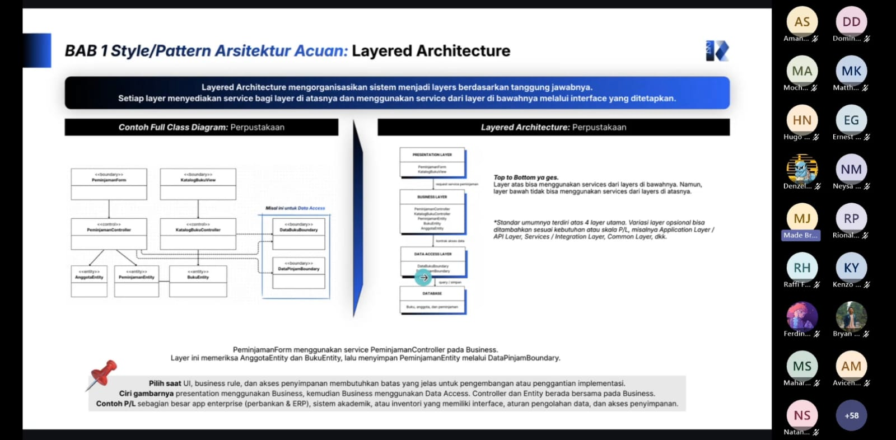

# Form Asistensi

## Tugas Besar IF2150 - Rekayasa Perangkat Lunak

| Informasi | Keterangan |
| --- | --- |
| **Hari** | *\[Jumat\]* |
| **Tanggal** | *\[02/10/2026\]* |
| **Kelas** | *\[K01\]* |
| **Nomor Kelompok** | *\[5\]*  |
| **Nama Kelompok** | *\[Furina: Forum RPL Indonesia Jaya\]*  |
| **Nama Perangkat Lunak** | *\[APATIS: Aplikasi Pelaporan Air dan Sanitasi\]*  |
| **Dokumen** | *\[K01_G05_APL\]*  |

### Anggota Kelompok

| NIM | Nama |
| --- | --- |
| *13525016* | *Kenzo Yo* |
| *13525112* | *Justin Sepvian* |
| *13525142* | *Jessica Audrey Tjahjadi* |
| *13525073* | *Nadia Layla Safira* |
| *13525097* | *Arini Karimatunnikmah* |

### Catatan

| Catatan |
| --- |
| 1. *Client server architecture membagi menjadi dua hal yakni client dan server, yang menerima dan memprovide service-nya*  |
| 2. *Setiap view harus menjelaskan sudut pandang yang berbeda dengan pattern yang konsisten* |
| 3. *Physical view digunakan ketika ingin memetakan P/L ke fisik atau cloud dari sudut pandang seorang software engineer, fokusnya pada komponen yang dijalankan secara fisik.* |
| 4. *Kalau ada komentar di physical view buat dalam kotak kecil dengan tulisan komentar dan garis putus-putus* |
| 5. *Node adalah perangkat keras, Execution Environment lingkungan perangkat lunak dalam node, artifact yakni file hasil build atau data scheme, communication path yakni garis yang menggambarkan komunikasi antar-node, dan catatan.*| 

**Notes for this section:**  
*Catatan dapat dituliskan dalam bentuk paragraf atau poin-poin, disesuaikan saja.* 
*Asistensi di atas merupakan asistensi akbar*

## Dokumentasi

<!--  -->

  

  <i>Gambar 1. Dokumentasi kegiatan asistensi.</i>

